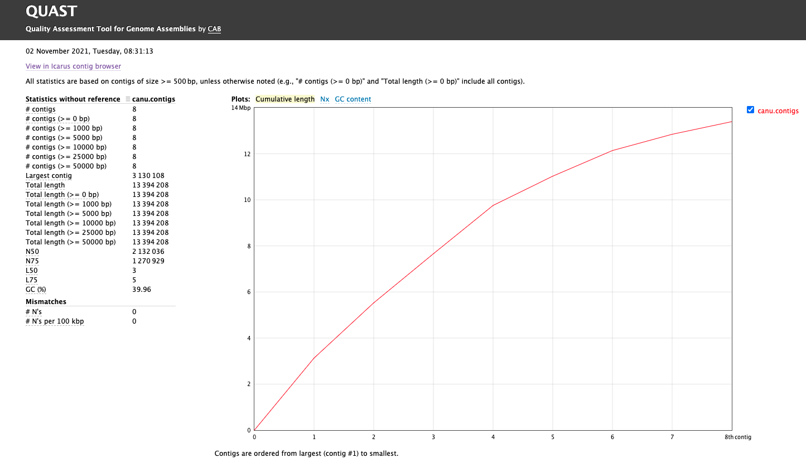
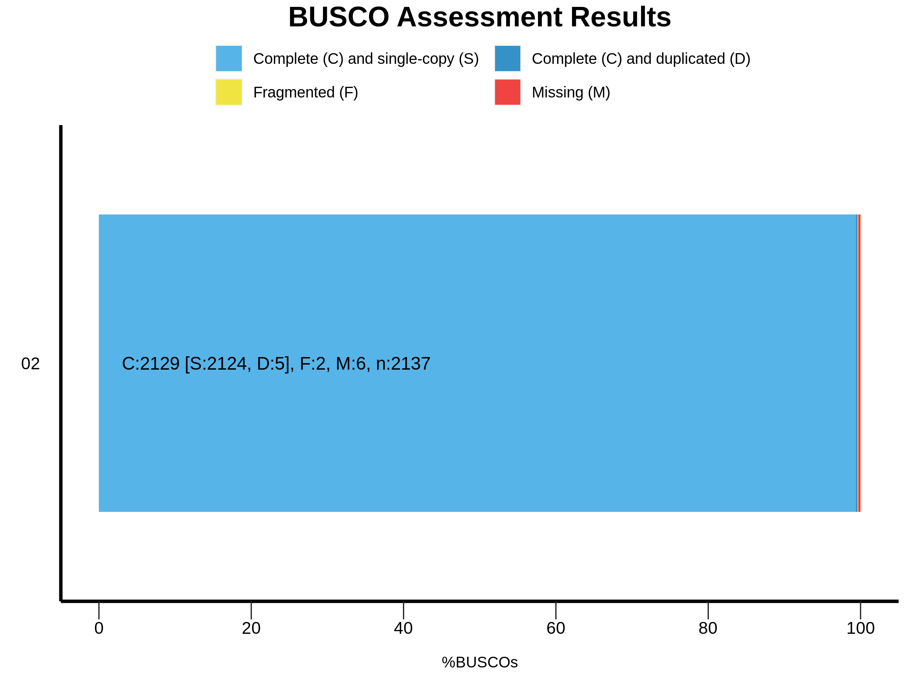

---
output:
    github_document:
    pandoc_args: --webtex
always_allow_html: true
---


<!-- README.md is generated from README.Rmd. Please edit that file -->

```{r, include = FALSE}
knitr::opts_chunk$set(
  collapse = TRUE,
  comment = "#>",
  fig.path = "imgs/",
  out.width = "100%"
)

knitr::opts_chunk$set(echo = TRUE)
```


<!-- badges: start -->


<!-- badges: end -->

# Genómica de Levaduras 
**Autor: MsC. Kelly Hidalgo**

Pipeline para montaje y anotación funcional de genomas de levaduras. Ensamblaje de un genoma de levadura a partir de secuencias largas de PacBio y cortas de Illumina para corrección de errores. 

## Herramientas bioinformáticas

### Instalación

**1. Instalación Miniconda**

Es recomendable instalar Anaconda, pues es la forma más fácil para instalar las herramientas bioinformáticas necesarias para el desarrollo de este pipeline. Anaconda es una distribución libre y abierta de los lenguajes *Python* y *R*, utilizada en ciencia de datos y bioinformática. Las diferentes versiones de los programas se administran mediante un sistema de gestión llamado *conda*, el cual hace bastante sencillo instalar, correr y actualizar programas.  [Aqui](https://conda.io/projects/conda/en/latest/user-guide/install/index.html) se encuentran las instrucciones para la instalación de Anaconda.

Después de instalado *Anaconda* y su gestor *Conda*, podran ser creados *ambientes virtuales* para la instalación de las diferentes herramientas bioinformáticas que serán usadas.

**2. Instalación FastQC**
[FastQC](http://www.bioinformatics.babraham.ac.uk/projects/fastqc/) es una herramienta para evaluar graficamente la calidad de las secuencias de Illumina. 

Las instrucciones para instalación usando conda se encuentran [aqui](https://anaconda.org/bioconda/fastqc). Sin embargo aqui en este tutorial también serán presentadas

Como ya fue explicado anteriorimente, con conda es posible crear ambientes virutuales para instalar las herramientas bioinformáticas. El primer ambiente que será creado se llamará **quality**, donde se instalaran los programas relacionados con este proceso.

```
conda create -n quality
```

Durante el proceso, el sistema preguntará sí desea proceder con la creación del ambiente, con las opciones y/n (si o no). Escriba `y` y después de eso el ambiente virtual estará creado.

Para instalar las herramientas dentro del ambiente anteriormente creado, es necesario activarlo

```
conda activate quality
```
El ambiente estará activo cuando el nombre de éste se encuentra en el comienzo de la linea de comando, así: `(quality) user@server:~/$`.

Posteriormente se procede a la instalación del programa:
```
conda install -c bioconda fastqc
```

De nuevo será cuestionado si desea continuar con el proceso o no. Escriba `y`.
 

**3. Instalación Trimmomatic v0.39**

[Trimmomatic](http://www.usadellab.org/cms/?page=trimmomatic) es un programa para filtrar (remover) lecturas o *reads* cortas de baja calidad.

Como se trata de una herramienta que participa dentro del proceso de control de calidad, será instalada dentro del ambiente virtual **quality**

```
# Si no está activado el ambiente
conda activate quality

# Instale Trimmomatic
conda install -c bioconda trimmomatic
```

**4. Instalación SequelTools**

Sequeltools es un programa que provee una colección de tres heramientas para trabajar con secuencias de PacBio. Las herramientas son: *Quality Control (QC) tool*, *Read Subsampling tool* y *Read Filtering tool*. La herramienta *QC* produce múltiples estadísticas y gráficos describiendo la calidad de los datos, inclueyendo N50, tamaño y cantidad de las lecturas, entre otras. *Read Subsampling tool* sirve para filtrar las secuencias usando algún critério, como por ejemplo las *subreads* más largas. 

SequelTools no está dentro de conda, por lo que será instalado de manera diferente. Sin embargo, primero va a ser creado un ambiente virtual llamado *mapping*, donde se instalarán herramientas relacionadas con la manipulación de secuencias de PacBio. SequelTools necesita algunas dependencias para funcionar, com *SamTools*, *Python* y *R*. Para usuarios de Linux, no es necesario instalar *Python* ni *R* pues vienen pre instaladas. *SamTools* será instalado dentro del ambiente virtual *mapping*.

```
# Crea el ambiente 
conda create -n mapping

# Activa el ambiente
conda activate mapping

# Instala SamTools
conda install -c bioconda samtools
```

A continuación los comandos para la instalacion *SequelTools* dentro do ambiente *mapping*

```
git clone https://github.com/ISUgenomics/SequelTools.git
cd SequelTools/Scripts
chmod +x *.sh *.py *.R
export PATH=$PATH:"$(pwd)"
```

**5. Instalación BedTools v2.30.0**

[BedTools](https://bedtools.readthedocs.io/en/latest/) es como una navaja suiza, es un conjunto de herramientas para una amplia gama de tareas en análisis genómicos. Por ejemplo, combinación de archivos, transformar archivos de un formato a otro, etc. 

Para instalar *BedTools* va a ser creado otro ambiente virtual, llamado *bioinfo*, donde van ser instalada lass herramientas para gestión de archivos y otras tareas "más simples".

```
# Crea el ambiente
conda create -n bioinfo

# Activa el ambiente
conda activate bioinfo

# Instala BedTools
conda install -c bioconda bedtools
```
**6. Instalación JellyFish v2.2.10**

[JellyFish](https://github.com/gmarcais/Jellyfish/blob/master/doc/Readme.md) es una herramienta que realiza el conteo de k-mers en el DNA, permitiendo calcular el tamaño aproximado del genoma y el poercentaje de heterogocidad, entre otras métricas.

Para instalar **JellyFish** será usado Conda y será instalado dentro del ambiente virtual **bioinfo**

```
# Si no está activado
conda activate bioinfo

# Instala Jellyfish
conda install -c bioconda jellyfish
```

**7. Instalación Canu v2.1.1**

[Canu](https://github.com/marbl/canu) es un ensamblador, diseñado especialmente para high-noise single-molecule sequencing, tales como *PacBio* o *Oxford Nanopore MinION*. Canu opera en tres fases: corrección, recorte y montaje. La fase de corrección mejorará la precisión de las bases en las lecturas. La fase de recorte recortará las lecturas en la parte que parezca ser una secuencia de alta calidad, eliminando las regiones sospechosas, como el adaptador SMRTbell restante. La fase de ensamblaje ordenará las lecturas en contigs, generará secuencias de consenso y creará gráficos de rutas alternativas.

Para la instalación de Canu, primero será creado um ambiente virutal llamado *assembly*, dentro del cual serán instaladas las herramientas relacionadas con el ensamblaje de genomas. 

Siga las siguientes instrucciones para la creación del ambiente virtual y posterior instalación de **Canu**

```
# Cree el ambiente virtual
conda create -n assembly

# Active el ambiente virtual
conda activate assembly

# Instale Canu
conda install -c bioconda canu
```

**8. Instalación Quast v5.0.2**

[Quast](http://quast.sourceforge.net/docs/manual.html) (*QUality ASsesment Tool*) es una herramienta para evaluar la calidad de genomas ensamblados calculando diversas métricas (tamaño de los contigs, número de contigs, N50, L50, etc)

```
# Active el ambiente bioinfo
conda activate bioinfo

# Instale Quast
conda install -c bioconda quast
```

**9.Instalación BUSCO v5.2.2**

[BUSCO](https://busco.ezlab.org/busco_userguide.html) es un porgrama que usa como base la filogenómica y los genes ortólogos para crear conjunto de genes por linajes, los cuales usa como base de datos para comparar contra genomas montados y calcular la completeza y contaminación del genoma estudiado.

Por problemas de compatibilidad de la versión de *Python* usada por este programa, es mejor instalarlo en un ambiente virutal separado. 
```
# Crea el ambiente virtual e instala Busco
conda create -n busco -c conda-forge -c bioconda busco=5.2.2
```

**10. Instalación MaSuRCA Toolkit v4.0.5**

[MaSuRCA](https://github.com/alekseyzimin/masurca) (*Maryland Super Read Cabog Assembler*) es un conjunto de herramientas (*toolkit* ) entre las que están, *MaSuRCA genome assembler*, *QuORUM error corrector*, *POLCA genome polishing*, *Chromosome scaffolder*, *Jellyfish kmer counter*, y *MUMmer aligner*. Por ahora usaremos especialmente **POLCA** para la etapa de *Polishing*.
**POLCA** es una herramienta de pulido destinada a mejorar la precisión del consenso en conjuntos de genomas producidos a partir de secuencias largas usando PacBio SMRT o Oxford Nanopore. **POLCA** utiliza lecturas Illumina o PacBio HIFI para el mismo genoma para mejorar la calidad de consenso del ensamblaje. Sus entradas son la secuencias del genoma y un archivo (o archivos) fasta o fastq de las lecturas de Illumina o PacBioHIFI y sus salidas son el genoma pulido y un archivo VCF con las variantes llamadas a partir de los datos leídos.

```
# Cree un ambiente llamado masurca
conda create -n masurca

# Active el nuevo ambiente
conda activate masurca

# Instale MaSuRCA
conda install -c bioconda masurca
```


**9. Instalación BWA**

[BWA](http://bio-bwa.sourceforge.net/bwa.shtml) es un alineador de secuencias. Será instalado como dependencia para **POLCA**.

```
# Si no está activado
conda activate masurca

# instale BWA
conda install -c bioconda bwa
```

**10. Instalación Spades v3.15.3**

[Spades](https://github.com/ablab/spades) es un ensamblador de genomas, que puede ser usado tanto para lecturas cortas como largas. 

Siga las siguientes instrucciones para la instalación de **Spades** dentro do ambiente virtual *assmebly*.

```
# Active el ambiente virtual
conda activate assembly

# Instale Spades
conda install -c bioconda spades
```

Ahora usted tiene tres ambientes: `quality`, `mapping`, `bioinfo` y `assembly`. En el primero, ud tiene instaladas los programas FastQC y Trimmomatic, en el segundo herramientas útiles para gestión de archivos, y en el tercero los ensambladores Canu y Spades. 

Ud puede pasar de un ambiente a otro usando el siguiente comando:
```
# Activa el ambiente quality
conda activate quality

# Activa el ambiente assembly
conda activate assembly
```

**9. Instalación Quast v5.0.2**

Quast (*Quality Assessment Tool for Genome Assemblies*), como su nombre lo indica es una herramienta para evaluar la calidad de las montajes de genomas. 

Instale esta herramienta dentro del ambiente bionfo.

```
# Activa el ambiente bioinfo
conda activate bioinfo

# Instala Quast
conda install -c bioconda quast
```

---
## 0. Organizando los datos

### 0.1. Secuencias

En este tutorial serán usados los datos de secuenciación del genoma de la levadura *Candida palmioleophila*.

**Archivos**

* `Cpalmiol_rawdata1.zip`: Secuencias PacBio
* `Cpalmiol_1.fastq.gz`: Secuencias Illumina (pair 1)
* `Cpalmiol_2.fastq.gz`: Secuencias Illumina (pair 2)

A continuación hay una serie de comandos para crear y organizar los directorios de las secuencias brutas

```
## Cree un directorio raiz para todo el processo
mkdir cpalmiol

## Entre al nuevo directorio
cd cpalmiol/

## Cree un nuevo directorio para colocar los datos brutos
mkdir 00.RawData

## Entre en 00.RawData
cd 00.RawData/

## Cree un directorio para cada tipo de secuencias
mkdir 01.PacBio 02.Illumina
```
Use el comando `mv` para mover los archivos hasta los directorios correspondientes. 

Al final del proceso de organización debe ver sus directorios así:
`ls 00.RawData/`
```
01.PacBio  02.Illumina
```
`ls 00.RawData/01.PacBio/`
```
Cpalmiol_rawdata1.zip
```
`ls 00.RawData/02.Illumina``
```
Cpalmiol_1.fastq.gz  Cpalmiol_2.fastq.gz
```
Es fuertemente recomendado correr los comandos desde el directorio base, que para este caso es: `cpalmiol/`

## 1. Control de Calidad

### 1.1. FastQC

**Illumina**
La primera etapa del proceso es la evaluación de la calidad de las secuencias cortas (Illumina paired end) usando *FastQC*, con el objetivo de determinar sí es necesario trimar o filtrar las secuencias de baja calidad en los próximos pasos. 

Ésta etapa es para identificar principalmente las secuencias *outlier* con baja calidad ($Q< 20$).

Active el ambiente `quality`:
```
conda activate quality

## Confirme que está en el directorio raíz
pwd
```

Debe estar em `~/cpalmiol/`. Si ese no es el resultado del comando `pwd`, use el comando `cd` para llegar en el directorio base.

Corra **FastQC**:
```
## Cree un directorio para salvar el output de FastQC
mkdir 01.FastqcReports
## Run usando 10 threads
fastqc -t 10 00.RawData/02.Illumina/* -o 01.FastqcReports/
```

**Sintaxis**
fastqc [opciones] input -o output

El comando `fastqc` tiene varias opciones o parametros, entre ellas, escoger el número de núcleos de la máquina para correr el análisis, para este caso `-t 10`. El input es el directorio que contiene las secuencias de illumina `00.RawData/02.Illumina/*`, el `*` indica al sistema que puede analizar todos los archivos que están dentro de ese directorio. El output, indicado por el parametro `-o`, es el directorio donde se desea que sean guardados los resultados del análisis. A continuación se encuentra una explicación detallada de cada output generado.

**Outputs**

* Reportes html `Cpalmiol_1_fastqc.html`: Aqui es posible ver toda información de calidad graficamente. 
* Zip files `Cpalmiol_1_fastqc.zip`: Aqui se encuentran cada uno de los gráficos de manera separada. *IGNORE**

Descargue los archivos `html` y explore en su *web browser*. 


Observe las estadísticas básicas que se encuentran en la primera tabla. Allí, ud puede saber cuantas secuencias tiene, para este caso son $20'203.852$ secuencias paired end, el tamaño de las secuencias es de $151$ bp y el %GC es de 39. El gráfico más importante para saber la calidad de las lecturas es el primero, *Per base sequence quality*. Este gráfico es un boxblot con la distribución de los valores de calidad *Phred Score* (eje y) en cada uno de los nucleótidos de las lecturas (eje x). Se consideran secuencias de excelente calidad cuando el $Phred Score > 30$. Los datos que están siendo analizados tienen alta calidad, sin embargo, el pair 2 presenta al final de las lecturas algunos valores outliers que pueden ser mejorados pasando por una etapa de filtrado con Trimmomatic. Es normal que el pair 2 presente una calidad un poco inferior al pair 1. 

**PacBio**

Los archivos de la secuenciación hecha por PacBio están comprimidos dentro de un archivo `.zip`, por lo tanto el primer paso es descomprimirlos.

```
# Entra en el directorio de las secuencias PacBio
cd 00.RawData/01.PacBio
# Descomprime
unzip Cpalmiol_rawdata1.zip
```

El comando `unzip` vai descomprimir el archivo `Cpalmiol_rawdata1.zip` generando un directorio llamado `Cpalmiol` donde se encuentran varios archivos, entre ellos, las secuencias en formato `subreads.fasta` y `subreads.bam`. Para organizar mejor los directorios, pase todos los archivos de la carpeta `Cpalmiol`, para `~/01.PacBio/` y elimine el directorio vazio. Siga los siguientes comandos:

```
# Desde la carpeta ~/01.PacBio/ mueve los archivos dentro Cpalmiol para ahí
mv Cpalmiol/* ./
# Elimina la carpeta Cpalmiol/
rm -r Cpalmiol/
```

Usando o *SequelTools* será evaluada la calidad de las secuencias generadas con PacBio. 

En este caso es solo una conjunto de datos, pero si fueran varios los siguientes comandos facilitan el proceso. Con estos comandos es posible crear un archivo de texto con la ubicación de los archivos de `subreads.bam` y `scraps.bam`

```
find $(pwd) -name "*subreads.bam"  > subFiles.txt
find $(pwd) -name "*scraps.bam"  > scrFiles.txt
```

Revise el contenido de los archivos generados
```
nano subFiles.txt
```
Para salir de `nano` use Ctrl+X

Ahora usando el script `SequelTools.sh` va a ser rodado la herramienta de control de calidad. 

```
# Activa o ambiente mapping
conda activate mapping
# Va al directorio de SequelTools
cd ../../SequelTools/Scripts/
# Corra SequelTools
bash SequelTools.sh -t Q -n 12 -u ../../00.RawData/01.PacBio/subFiles.txt -o ../../03.PacBioQuality
```

**Sintaxis**
`path/to/SquelTools.sh [opciones] -u subreads.files o outputpath/`

Las opciones usadas fueron: `-t Q` indica para el programa que será rodado la herramienta de control de calidad. Las otras opciones son `S` para *Subsamplig* y `F`para *Filtering*; `-n 20` para indicar el número de núcleos a usar durante el proceso. En `-u` se debe indicar el camino al archivo `.txt` con la ubicación de los archivos `.subreads.bam`. Por útlimo `-o` indica el directorio para salvar los archivos de salida del proceso. 

Como salida, el programa crea varios gráficos y una tabla con el resumen de las métricas más importantes, como: *número de reads, bases totales, N50*, entre outras.

```{r, echo=FALSE, eval=TRUE, message=FALSE}
require(kableExtra)
require(dplyr)

df <- read.delim("docs/summaryTable.txt", sep = "\t", header = TRUE)

df1 <- df %>% 
  select(numReadsSubread,totalBasesSubread , meanReadLenSubread,
         n50Subread) %>% 
  rename(`Número Reads` = numReadsSubread,
        `Total Bases` = totalBasesSubread,
       `Tamaño Promedio de las reads` = meanReadLenSubread,
       `N50` = n50Subread)

df1 %>% 
  kable(escape = F, full_width = FALSE) %>%
  kable_material_dark()
```
### 1.2. Trimmomatic

Según fue evaluado en el control de calidad, será necesario filtrar algunas lecturas con una calidad un poco por debajo de lo necesario.

El programa Trimmomatic tiene vários parametros que pueden ser considerados para filtrar lecturas con baja calidad. Aqui usaremos algunos. Si quiere saber que otros parametros y como funciona cada uno de ellos, consulte el [manual](http://www.usadellab.org/cms/uploads/supplementary/Trimmomatic/TrimmomaticManual_V0.32.pdf).

Para los datos aqui analizados se usará la siguiente linea de comando:
```
# Activa el ambiente quality
conda activate quality

# Crie un directorio para salvar las lecturas limpias
mkdir 02.CleandData

# Crie un directorio para salvar las lecturas no pareadas
mkdir unpaired

# Corra Trimmomatic
trimmomatic PE -threads 10 00.RawData/02.Illumina/Cpalmiol_1.fastq.gz 00.RawData/02.Illumina/Cpalmiol_2.fastq.gz 02.CleandData/Cpalmiol_1_paired.fastq.gz unpaired/Cpalmiol_1_unpaired.fastq.gz 02.CleandData/Cpalmiol_2_paired.fastq.gz unpaired/Cpalmiol_2_unpaired.fastq.gz LEADING:3 TRAILING:3 SLIDINGWINDOW:4:15
```

**Sintaxis**
trimmomatic PE -threads input_forward input_reverse output_forward_paired output_forward_unpaired output_reverse_paired output_reverse_unpaired [opciones]

El comando anterior tiene muchas partes. Primero, el nombre del comando es `trimmomatic`, a continuación la opción `PE` indica para el programa que las secuencias que irán a ser analizadas son de tipo *paired end*. Después se encuentran los inputs, forward (pair1) y reverse (pair2). Después son los outputs, siendo primero las secuencias forward pareadas (limpias) y no pareadas ("descartadas") y después las secuencias reverse. Por último se encuentran los parametros de filtrado. Para este caso usamos los parametros `SLIDINGWINDOW`, `LEADING` y `TRAILING`. El primero de ellos, genera una ventana deslizante, que en este caso va de 4 en 4 bases, cálcula el promedio del *Phred Score* y si está por debajo de 15 esas bases son cortadas. `LEADING` corta bases del comienzo de la lectura si están por debajo de *threshold* de calidad, lo mismo hace `TRAILING` pero al final de las lecturas. 

Después de correr Trimmomatic es necesario evaluar la calidad de las secuencias generadas ("limpias") usando nuevamente FastQC.

```
fastqc -t 10 02.CleandData/* -o 01.FastqcReports/
```

Descargue los reportes `.html` de las secuencias pareadas (i.e. `01.FastqcReports/Cpalmiol_1_paired_fastqc.html` y `01.FastqcReports/Cpalmiol_2_paired_fastqc.html`)


Observe que ahora todas las bases en ambos archivos tienen $Phred Score > 30$. Después del proceso de filtrado sobrevivieron $20'166.545$ *reads*, es decir $99.8%$ de las secuencias iniciales. 
### 1.3. Análisis de Kmers

Este análisis es realizado con el objetivo de determinar el tamaño aproximado del genoma (**importantísimo para el ensamblaje**) y el grado de *heterogocidad*. Será usada la herramienta **Jellyfish** para el cálculo de las métricas y la plataforma online [Genome Scope](http://qb.cshl.edu/genomescope/) para graficar los resultados.

El análisis será realizado usando como longitud de k-mer 21, que es un tamaño suficientemente largo como para que la mayoria de los k-mers no sean repetitivos y es lo suficientemente corta para que el análisis sea más robusto a los errores de secuenciación. Debido a que a la alta tasa de error de las secuencias PacBio (~5-15%), no puede ser usadas para este análisis. Es necesario usar las secuencias cortas de Illumina que tienen una tasa de error de alrededor de 2%. 

Primero, cree un directorio para los archivos de salida del análisis.
```
mkdir 04.KmersAnalysis
```
Jellyfish solo soporta archivos sin compresión, por eso es necesario primero descomprimir las secuencias.
```
gzip -d 02.CleanData/*
```
El comando del análisis se encuentra a continuación
```
# Si no está activado...
conda activate bioinfo

# Jellyfish
jellyfish count -C -m 21 -s 1000000000 -t 10 02.CleanData/*.fastq -o 04.KmersAnalysis/reads.jf
```

Usted debe ajustar la memória (`-s`) y los núcleos (`-t`) de acuerdo con su máquina. El comando anterior usa 10 núcleos/threads y 1Gb de memória RAM.

A continuación, es necesario exportar el conteo de k-mers para un histograma, el cual será el input para la plataforma [Genome Scope](http://qb.cshl.edu/genomescope/) graficar. 

```
jellyfish histo -t 10 04.KmersAnalysis/reads.jf > 04.KmersAnalysis/reads.histo
```
Use el archivo `reads.histo` para graficar en *GenomeScope*, modifique los valores de entrada: Read Length 150.

[Resultados](http://genomescope.org/analysis.php?code=d5CPxD4htefge2NqgdWd)

Observe que el perfil tiene un solo pico, lo que significa que se trata de un organismo haploide. El porcentaje de heterogocidad es 0.0009%, confirmando la ploidia. El tamaño del genoma fue estimado en 12.616.309 bp o 12.6 Mbp. El porcentaje de repeticiones es del 1.7% siendo de 222.701 bp.

### 1.4. Cobertura

Cuando se trabaja con secuenciación de genomas, el siguiente paso después de conocer la cantidad de secuencias obtenidas y remover las secuencias con baja calidad, es calcular la cobertura o profundidad del secuenciamiento para ese genoma. El cálculo de la cobertura está dado por la siguiente ecuación:

$$C = (L*N)/G$$
Donde:
L es igual al tamaño de las lecturas,
N es igual al número de lecturas, y
G es igual al tamaño aproximado del genoma.

Así, entonces para el genoma del presente tutorial, con el secuenciamiento Illumina tenemos:

$$C = ((150bp * 2) * 20166545bp)/12616309bp$$
```{r, echo=FALSE}
c = ((150*2)*2.0E7)/1.2E7
print(paste0("La cobertura con illumina es de ", round(c, digits = 0),"x"))
```
Con el secuenciamiento PacBio tenemos:

$$C = ((14465 * 20166545bp)/12616309bp$$
```{r, echo=FALSE}
cpb = (14465*631994)/12616309
print(paste0("La cobertura con PacBio es de ", round(cpb, digits = 0),"x"))
```

## 2. Ensamblaje

El ensamblaje del genoma es la etapa más importante del proceso, porque el resto de pasos para adelante dependen de que el genoma quede montado lo "más parecido posible" con la realidad. Por esta razón, serán testados varios montadores y parametros, para comparar cada ensamblaje y decidir cual es el mejor para los siguientes procesos. 

### 2.1. Conversión de archivos

Debido a que las secuencias de *PacBio* no están en formato `.fastq` es necesario transformar los archivos `.bam`, para esto va a ser usado BedTools, más exactamente la utilidad `bamtofastq`.
Recuerde que *BedTools* fue instalado dentro del ambiente virtual `bioinfo`
```
# Activa el ambiente
conda activate bioinfo

# Corra bedtools bamtofastq
bedtools bamtofastq -i 00.RawData/01.PacBio/m54229_191221_175250.subreads.bam -fq 00.RawData/01.PacBio/Cpalmiol_PB.fq

# Confirme que el archivo fue creado
ls 00.RawData/01.PacBio/Cpalmiol_PB.fq
```

### 2.2. Canu

Además de ensamblar las secuencias, Canu, también va a corregir y a trimarlas. Ahora que tenemos las secuencias en formato `.fq`, podemos correr Canu para el ensamblaje.

**Nota:** Este proceso demora aproximadamente ~14h.

```
# Cria um directorio nuevo para el resultado de Canu
mkdir 05.Assemblies

mkdir 05.Assemblies/01.Canu

# Corre Canu
canu -p canu -d 05.Assemblies/01.Canu genomeSize=12.6m -maxMemory=25g -maxThreads=15 utgOvlErrorRate=0.065 trimReadsCoverage=2 trimReadsOverlap=500 -pacbio-raw 00.RawData/01.PacBio/Cpalmiol_subreads.fasta
```

**Sintaxis**
`canu -p prefix -d path/to/output genomeSize=x corThreads=x -pacbio-raw path/to/sequences/file.fq`

El comando es `canu`. El parametro `-p canu` indica al programa que prefijo usar para todos los archivos de salida. `-d 05.Assemblies/01.Canu` indica donde ubicar los archivos de salida. En `genomeSize` se coloca el tamaño esperado (aproximado) del genoma. En `MaxThreads` se indica el número máximo de núcleos a usar en todas las etapas del proceso. En `MaxMemory` se indica el número máximo de memória RAM a usar en todas las etapas del proceso. Y por último `pacbio-raw` es para indicar el camino a la carpeta que contiene las secuencias. 

Durante la corrida, Canu va a imprimir informaciones en la pantalla relacionadas con cada paso del proceso.

**Output**

En el directorio `05.Assemblies/01.Canu` fueron creados varios outputs, use el comando `ls` para listar los archivos en el directorio de salida.

* `canu.contigs.fasta`: contiene las secuencias ensambladas
* `canu.unassembled.fasta`: son las lecturas que no pudieron ser ensambladas.
* `canu.correctedReads.fasta.gz`: son las secuencias corregidas que fueron usadas para el montaje.
* `canu.contigs.gfa`: es el gráfico del montaje.
* `canu.report`: es un archivo con el resumen de cada paso que Canu realizó com información acerca de las secuencias usadas, y como se manejaron y otras informaciones resumidas sobre el montaje.

Siempre es bueno cambiar algunos parametros y correr de nuevo para comparar los montajes y escoger el mejor. Entonces corra otro montaje con Canu cambiando los parametros default, según las [recomendaciones](https://canu.readthedocs.io/en/latest/faq.html#what-parameters-should-i-use-for-my-reads) de los desarrolladores. 

En la primer intento fueron rodados los siguentes parámetros:
* `rawErrorRate=0.300`: es la diferencia permitida en un *overlap* entre dos secuencias crudas no corregidas. Para secuencias con calidad baja, aumente el número.
* `correctedErrorRate=0.045`: es la diferencia permitida en un *overlap* entre dos secuencias corregidas. Montajes con baja con baja cobertura, aumnete levemente este número.
* `minReadLength=1000`: Ignora *reads* menores de ese tamaño.
* `minOverlapLength=500`: Ignora *overlaps* read-to-read menores de ese tamaño.
* `corMhapSensitivity="normal"`: baseado en la cobertura del secuenciamiento (el cual es impactado por el tamaño del genoma), *"low" sensitivity* si la cobertura es más de $600x$; *"normal" sensitivity* si la cobertura está entre $60x$ y $30x$, y *"high" sinsitivity* si la cobertura es menor que $30x$.
* Entre outros parámetros, para más información consulte [aqui](https://canu.readthedocs.io/en/latest/parameter-reference.html)


### 2.3.1. Calidad del montaje

Para evaluar la calidad del montaje, serán usadas dos herramientas, **Quast** y **Busco**.

**Quast**

 Con **Quast** es posible evaluar las principales estadísticas del montaje (i.e. N50, número de contigs, tamaño total del montaje, tamaño de los contigs, etc). **Quast** genera una serie de archivos y reportes donde es posible observar esas estadísticas básicas del montaje. También permite comparar entre varios montajes con el objetivo de escoger el mejor.

```
# Active el ambiente bioinfo
conda activate bioinfo

# Crie um diretório para el output
mkdir 06.AssemblyQuality
mkdir 06.AssemblyQuality/01.Canu
mkdir 06.AssemblyQuality/01.Canu/01.Quast
# Corra Quast
quast.py 05.Assemblies/01.Canu/canu.contigs.fasta -o 06.AssemblyQuality/01.Canu/01.Quast
```
**Sintaxis**
`quast.py path/to/assembly/contigs.fast -o path/to/output/`

**Interpetación de los resultados**

La idea de usar **Quast**, aparte de evaluar las estidísticas básicas del montaje, es comparar varios montajes para escoger el mejor. Por ejemplo: entre menor sea el número de contigs es mejor, porque significa que el genoma quedó menos fragementado. Y eso se reflejará en el tamaño de los contigs que serán grandes. El valor de N50, es mejor entre mayor sea. Así mismo, es ideal menor número de gaps y Ns. 

**Outputs**

Explore el directorio de output usando el comando `ls`.

* `report.html`: Este reporte puede ser abierto en un *web browser* y contiene las informaciones más relevantes. Como número de contigs, tamaño del mayor contig, tamaño total del montaje, N50, etc.



* `report.tex`, `report.txt`, `report.tsv`, `report.pdf`: es el mismo reporte pero en diferentes formatos. 

* `transposed_report.tsv`, `transposed_report.tex`, `transposed_report.tex`: También es el reporte pero con otro formato de las tablas. 

* `icarus_viewers/contig_size_viewer.html`: Aqui puede ver graficamente los contigs. 

* `basis_stats/`: Dentro de esta carpeta se encuentran varios gráficos en formato `.pdf`. 

**Nota: Es posible correr el montaje de nuevo con otros parámetros para comparar y escoger el mejor, según las métricas de evaluación de la calidad del montaje**

**Busco**

Este programa está baseado en las expectativas evolutidas del contenido de genes ortólogos de copia única. Es decir, con esta herramienta podemos evaluar que tan completo está el genoma, teniendo en cuenta los genes de copia única y así mismo que tan contaminado está si estos genes son encontrados más de una vez en el genoma. Para esto es usado un conjunto de genes encontrados en linajes relacionadas al genoma en estudio. Para nuestro caso, será usado el conjunto de genes de la clase Saccharomycetes.

```
# Entre a la carpeta 06.AssemblyQuality/01.Canu
cd 06.AssemblyQuality/01.Canu/

# Activa el ambiente busco
conda activate busco
```
Antes de correr el análisis en BUSCO, explore las opciones en el menú de ayuda, con `busco -h`.
```
# Busco
busco -m genome -i ../../../05.Assemblies/01.Canu/canu.contigs.fasta -o 02.Busco -l saccharomycetes_odb10 -c 15
```

**Sintaxis**

`busco -m [mode] -i [sequence_file] -l [lineage] [other options]`

* `-m` o `--mode`: hay tres modos dependiendo del tipo de información que se va a analizar: genome, proteins, transcriptome.

* `-i` o `--in`: datos de entrada, p.e. contigs montados. 

* `-l` o `--lineage_dataset`: informe aqui la base de datos que quiere usar, según el linaje escogido. Para saber que linajes se encuentran en la base de datos de BUSCO, digite `busco --list-datasets`.

**Interpretación de los resultados**

**Busco** intenta proporcionar una evaluación cuantitativa de la completitud en términos del contenido génico esperado de un genoma montado. Los resultados se simplifican en las categorías *complete* y *single-copy*, *complete* y *duplicated*, *fragmented* o *missing* BUSCOs. 

Los resultados de la completud de BUSCO tienen sentido solo en el contexto de la biología de su organismo. Debe comprender si los genes faltantes (*missing*) o duplicados (*duplicated*) son de origen biológico o técnico. Por ejemplo, un alto nível de duplicación puede explicarse por un evento de duplicación completo reciente (biológico) o un ensamblaje quimérico de haplotipos (técnico). 

**outputs**

* `run_saccharomycetes_odb10/busco_sequences`: dentro de esta carpeta se encuentran las secuencias en formato `.fasta` de los BUSCOs **fragmented** (`fragmented_busco_sequences/`), *multi-copy*, (`multi_copy_busco_sequences/`), *single-copy* (`single_copy_busco_sequences/`).

* `run_saccharomycetes_odb10/short_summary.txt`: Es un archivo de texto plano que contine el resumen de los resultados de BUSCO. Aqui se encuentra el resultado final, es decir, el número y porcentaje de BUSCOs completos, single-copy, duplicados, fragmentados y missing.

```
***** Results: *****

	C:99.6%[S:99.4%,D:0.2%],F:0.1%,M:0.3%,n:2137	   
	2129	Complete BUSCOs (C)			   
	2124	Complete and single-copy BUSCOs (S)	   
	5	Complete and duplicated BUSCOs (D)	   
	2	Fragmented BUSCOs (F)			   
	6	Missing BUSCOs (M)			   
	2137	Total BUSCO groups searched
```

* `run_saccharomycetes_odb10/full_table.tsv`: Es una tabla con los resultados completos, con *scores* y tamaños de los BUSCOs encontrados, además de las coordinadas dentro del genoma.

* `run_saccharomycetes_odb10/missing_busco_list.tsv`: Contiene la lista de *missing BUSCOs*.

* `run_saccharomycetes_odb10/hmmer_output/`: tablas con la salida de HMMER con las busquedas de BUSCOs HMMs.

* `run_saccharomycetes_odb10/meaeuk_output/`: Resultados de la predicción de genes con *Metaeuk*. 

* `busco_downloads/`: en este directorio está la base de datos que BUSCO descargó, según el linaja escogido, Saccharomycetes.

* `logs/`: Aqui se encuentran los logs de cada programa usado durante el processo, `busco.log`, `hmmsearch_err.log`, `hmmsearch_out.log`, `metaeuk_err.log` y `metaeuk_out.log`.

**Gráfico**

Los desarrolladores de **Busco** disponibilizaron un script de **Python** y **R** para graficar los resultados. A continuación el comando para usarlo:

```
python3 generate_plot.py -wd 02.Busco/
```

Rapidamente será generado un gráfico de barras con el porcentaje de cada tipo de genes encontrados en el genoma.


## 3. Polishing

En esta etapa serán usadas las secuencias cortas de Illumina con el fin de corregir errores en el genoma montado. En un primer paso serán alineadas estas secuencias en el genoma ensamblado con los programas **BWA**. Y en segunda instancia será usado **Polca** para corregir pequeños indels, gaps, montajes errados, etc. 

El programa **Polca** realiza todo el proceso con una sola linea de comando. 

```
## Activa el ambiente masurca
conda activate masurca

## Vuelva al directorio base

cd ../../

## Confirme 
pwd

## Cree un directorio para el output
mkdir 08.Polishing

# Entre al nuevo directorio
cd 08.Polishing/
```
Corra Polca
```
polca.sh -a ../05.Assemblies/01.Canu/canu.contigs.fasta -r '../02.CleanData/Cpalmiol_1_paired.fastq ../02.CleanData/Cpalmiol_2_paired.fastq' -t 15 -m 1G
```

**Sintaxis**

`polca.sh -a genome.fasta -r 'reads1.fastq reads2.fastq' -t [núm threads] -m [gigas de memoria]`

* `-a`: Genoma montado
* `-r`: reads cortas
* `-t`: Número de núcleos/threads
* `-m`: Gigas de memoria por thread para samtools

**Outputs**

Polca va a generar una serie de archivos relacionados al mapeo de las secuencias cortas en el montaje. Los dos *outputs* más importantes son `canu.contigs.fasta.report` y `canu.contigs.fasta.PolcaCorrected.fa`. En el primero se encuentran las estadísticas básicas del proceso y el segundo es el genoma mejorado.

`less canu.contigs.fasta.report`

```
Substitution Errors: 31
Insertion/Deletion Errors: 56
Assembly Size: 13394208
Consensus Quality: 99.9994
```
 Se puede observar que fueron corregidos 31 errores de substitución, 56 de inserción o deleción y que la calidad consenso del genoma es 99.99%.
 

### 3.1. Calidad del montaje pulido

Con el objetivo de evaluar las mejorías del genoma después del *polishing*, debe ser rodado nuevamente **Quast** y **Busco**.

Primero para facilitar, cambie el nombre del archivo del genoma pulido `canu.contigs.fasta.PolcaCorrected.fa` para `genome_polished.fasta` usando el comando `mv`.

**Quast**
```
# Vuelva para el directorio base
cd ../

# Active el ambiente bioinfo
conda activate bioinfo

# Crie um diretório para el output
mkdir 06.AssemblyQuality/02.PolishedGenome
mkdir 06.AssemblyQuality/02.PolishedGenome/01.Quast

# Corra Quast
quast.py 05.Assemblies/01.Canu/canu.contigs.fasta 07.Polishing/genome_polished.fasta  -o 06.AssemblyQuality/02.PolishedGenome/01.Quast
```

Descargue el archivo `report.html`


Observe que todas las métricas fueron mejoradas con el *polishing*.

**BUSCO**

```
# Active el ambiente busco
conda activate busco

# Cree directorios para el output
mkdir 06.AssemblyQuality/02.PolishedGenome/02.Busco


# Entre al directorio 
cd 06.AssemblyQuality/02.PolishedGenome

busco -m genome -i ../../07.Polishing/genome_polished.fasta -o 02.Busco -l saccharomycetes_odb10 -c 15
```

`nano 02.Busco/run_saccharomycetes_odb10/short_summary.txt`

Resultado

```
***** Results: *****

        C:99.6%[S:99.4%,D:0.2%],F:0.1%,M:0.3%,n:2137
        2129    Complete BUSCOs (C)
        2124    Complete and single-copy BUSCOs (S)
        5       Complete and duplicated BUSCOs (D)
        2       Fragmented BUSCOs (F)
        6       Missing BUSCOs (M)
        2137    Total BUSCO groups searched
```

**Gráfico**

Crie el gráfico de barras con el resultado de Busco

```
python3 generate_plot.py -wd 02.Busco/
```



En cuanto a completud y contaminación, no hubo cambios entre el genoma montado original y el pulido.


### 2.3. Spades

A diferencia de *Canu*, *Spades* fue diseñado para montar genomas con secuencias cortas (i.e Illumina), sin embargo el también puede hacer "montajes híbridas" combinando secuencias cortas e largas (i.e. Nanopore, PacBio).

A continuación, se encuentra la línea de comando para correr Spades:

```

```


