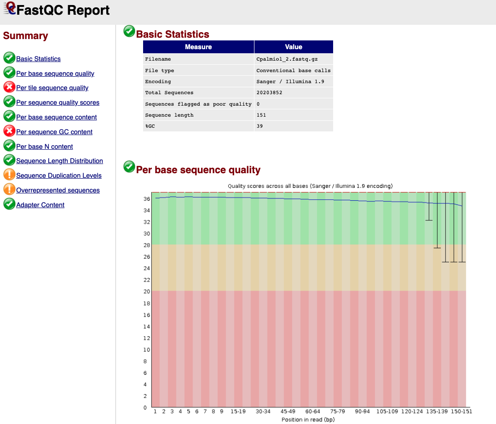

---
output:
    github_document:
    pandoc_args: --webtex
always_allow_html: true
---


<!-- README.md is generated from README.Rmd. Please edit that file -->

```{r, include = FALSE}
knitr::opts_chunk$set(
  collapse = TRUE,
  comment = "#>",
  fig.path = "imgs/",
  out.width = "100%"
)

knitr::opts_chunk$set(echo = TRUE)
```


<!-- badges: start -->


<!-- badges: end -->

# Genómica de Levaduras 
**Autor: MsC. Kelly Hidalgo**

Pipeline para montaje y anotación funcional de genomas de levaduras. Ensamblaje de un genoma de levadura a partir de secuencias largas de PacBio y cortas de Illumina para corrección de errores. 

## Herramientas bioinformáticas

### Instalación

**1. Instalación Miniconda**

Es recomendable instalar Anaconda, pues es la forma más fácil para instalar las herramientas bioinformáticas necesarias para el desarrollo de este pipeline. Anaconda es una distribución libre y abierta de los lenguajes *Python* y *R*, utilizada en ciencia de datos y bioinformática. Las diferentes versiones de los programas se administran mediante un sistema de gestión llamado *conda*, el cual hace bastante sencillo instalar, correr y actualizar programas.  [Aqui](https://conda.io/projects/conda/en/latest/user-guide/install/index.html) se encuentran las instrucciones para la instalación de Anaconda.

Después de instalado *Anaconda* y su gestor *Conda*, podran ser creados *ambientes virtuales* para la instalación de las diferentes herramientas bioinformáticas que serán usadas.

**2. Instalación FastQC**
[FastQC](http://www.bioinformatics.babraham.ac.uk/projects/fastqc/) es una herramienta para evaluar graficamente la calidad de las secuencias de Illumina. 

Las instrucciones para instalación usando conda se encuentran [aqui](https://anaconda.org/bioconda/fastqc). Sin embargo aqui en este tutorial también serán presentadas

Como ya fue explicado anteriorimente, con conda es posible crear ambientes virutuales para instalar las herramientas bioinformáticas. El primer ambiente que será creado se llamará **quality**, donde se instalaran los programas relacionados con este proceso.

```
conda create -n quality
```

Durante el proceso, el sistema preguntará sí desea proceder con la creación del ambiente, con las opciones y/n (si o no). Escriba `y` y después de eso el ambiente virtual estará creado.

Para instalar las herramientas dentro del ambiente anteriormente creado, es necesario activarlo

```
conda activate quality
```
El ambiente estará activo cuando el nombre de éste se encuentra en el comienzo de la linea de comando, así: `(quality) user@server:~/$`.

Posteriormente se procede a la instalación del programa:
```
conda install -c bioconda fastqc
```

De nuevo será cuestionado si desea continuar con el proceso o no. Escriba `y`.
 

**3. Instalación Trimmomatic v0.39**

[Trimmomatic](http://www.usadellab.org/cms/?page=trimmomatic) es un programa para filtrar (remover) lecturas o *reads* cortas de baja calidad.

Como se trata de una herramienta que participa dentro del proceso de control de calidad, será instalada dentro del ambiente virtual **quality**

```
# Si no está activado el ambiente
conda activate quality

# Instale Trimmomatic
conda install -c bioconda trimmomatic
```

**4. Instalación SequelTools**

Sequeltools es un programa que provee una colección de tres heramientas para trabajar con secuencias de PacBio. Las herramientas son: *Quality Control (QC) tool*, *Read Subsampling tool* y *Read Filtering tool*. La herramienta *QC* produce múltiples estadísticas y gráficos describiendo la calidad de los datos, inclueyendo N50, tamaño y cantidad de las lecturas, entre otras. *Read Subsampling tool* sirve para filtrar las secuencias usando algún critério, como por ejemplo las *subreads* más largas. 

SequelTools no está dentro de conda, por lo que será instalado de manera diferente. Sin embargo, primero va a ser creado un ambiente virtual llamado *mapping*, donde se instalarán herramientas relacionadas con la manipulación de secuencias de PacBio. SequelTools necesita algunas dependencias para funcionar, com *SamTools*, *Python* y *R*. Para usuarios de Linux, no es necesario instalar *Python* ni *R* pues vienen pre instaladas. *SamTools* será instalado dentro del ambiente virtual *mapping*.

```
# Crea el ambiente 
conda create -n mapping

# Activa el ambiente
conda activate mapping

# Instala SamTools
conda install -c bioconda samtools
```

A continuación los comandos para la instalacion *SequelTools* dentro do ambiente *mapping*

```
git clone https://github.com/ISUgenomics/SequelTools.git
cd SequelTools/Scripts
chmod +x *.sh *.py *.R
export PATH=$PATH:"$(pwd)"
```

**5. Instalación BedTools v2.30.0**

[BedTools](https://bedtools.readthedocs.io/en/latest/) es como una navaja suiza, es un conjunto de herramientas para una amplia gama de tareas en análisis genómicos. Por ejemplo, combinación de archivos, transformar archivos de un formato a otro, etc. 

Para instalar *BedTools* va a ser creado otro ambiente virtual, llamado *bioinfo*, donde van ser instalada lass herramientas para gestión de archivos y otras tareas "más simples".

```
# Crea el ambiente
conda create -n bioinfo

# Activa el ambiente
conda activate bioinfo

# Instala BedTools
conda install -c bioconda bedtools
```

**6. Instalación Canu v2.1.1**

[Canu](https://github.com/marbl/canu) es un ensamblador, diseñado especialmente para high-noise single-molecule sequencing, tales como *PacBio* o *Oxford Nanopore MinION*. Canu opera en tres fases: corrección, recorte y montaje. La fase de corrección mejorará la precisión de las bases en las lecturas. La fase de recorte recortará las lecturas en la parte que parezca ser una secuencia de alta calidad, eliminando las regiones sospechosas, como el adaptador SMRTbell restante. La fase de ensamblaje ordenará las lecturas en contigs, generará secuencias de consenso y creará gráficos de rutas alternativas.

Para la instalación de Canu, primero será creado um ambiente virutal llamado *assembly*, dentro del cual serán instaladas las herramientas relacionadas con el ensamblaje de genomas. 

Siga las siguientes instrucciones para la creación del ambiente virtual y posterior instalación de **Canu**

```
# Cree el ambiente virtual
conda create -n assembly

# Active el ambiente virtual
conda activate assembly

# Instale Canu
conda install -c bioconda canu
```

**7. Instalación Spades v3.15.3**

[Spades](https://github.com/ablab/spades) es un ensamblador de genomas, que puede ser usado tanto para lecturas cortas como largas. 

Siga las siguientes instrucciones para la instalación de **Spades** dentro do ambiente virtual *assmebly*.

```
# Active el ambiente virtual
conda activate assembly

# Instale Spades
conda install -c bioconda spades
```

Ahora usted tiene tres ambientes: `quality`, `mapping`, `bioinfo` y `assembly`. En el primero, ud tiene instaladas los programas FastQC y Trimmomatic, en el segundo herramientas útiles para gestión de archivos, y en el tercero los ensambladores Canu y Spades. 

Ud puede pasar de un ambiente a otro usando el siguiente comando:
```
# Activa el ambiente quality
conda activate quality

# Activa el ambiente assembly
conda activate assembly
```

**8. Instalación Quast v5.0.2**

Quast (*Quality Assessment Tool for Genome Assemblies*), como su nombre lo indica es una herramienta para evaluar la calidad de las montajes de genomas. 

Instale esta herramienta dentro del ambiente bionfo.

```
# Activa el ambiente bioinfo
conda activate bioinfo

# Instala Quast
conda install -c bioconda quast
```

---
## 0. Organizando los datos

### 0.1. Secuencias

En este tutorial serán usados los datos de secuenciación del genoma de la levadura *Candida palmioleophila*.

**Archivos**

* `Cpalmiol_rawdata1.zip`: Secuencias PacBio
* `Cpalmiol_1.fastq.gz`: Secuencias Illumina (pair 1)
* `Cpalmiol_2.fastq.gz`: Secuencias Illumina (pair 2)

A continuación hay una serie de comandos para crear y organizar los directorios de las secuencias brutas

```
## Cree un directorio raiz para todo el processo
mkdir cpalmiol

## Entre al nuevo directorio
cd cpalmiol/

## Cree un nuevo directorio para colocar los datos brutos
mkdir 00.RawData

## Entre en 00.RawData
cd 00.RawData/

## Cree un directorio para cada tipo de secuencias
mkdir 01.PacBio 02.Illumina
```
Use el comando `mv` para mover los archivos hasta los directorios correspondientes. 

Al final del proceso de organización debe ver sus directorios así:
`ls 00.RawData/`
```
01.PacBio  02.Illumina
```
`ls 00.RawData/01.PacBio/`
```
Cpalmiol_rawdata1.zip
```
`ls 00.RawData/02.Illumina``
```
Cpalmiol_1.fastq.gz  Cpalmiol_2.fastq.gz
```
Es fuertemente recomendado correr los comandos desde el directorio base, que para este caso es: `cpalmiol/`

## 1. Control de Calidad

### 1.1. FastQC

**Illumina**
La primera etapa del proceso es la evaluación de la calidad de las secuencias cortas (Illumina paired end) usando *FastQC*, con el objetivo de determinar sí es necesario trimar o filtrar las secuencias de baja calidad en los próximos pasos. 

Ésta etapa es para identificar principalmente las secuencias *outlier* con baja calidad ($Q< 20$).

Active el ambiente `quality`:
```
conda activate quality

## Confirme que está en el directorio raíz
pwd
```

Debe estar em `~/cpalmiol/`. Si ese no es el resultado del comando `pwd`, use el comando `cd` para llegar en el directorio base.

Corra **FastQC**:
```
## Cree un directorio para salvar el output de FastQC
mkdir 01.FastqcReports
## Run usando 10 threads
fastqc -t 10 00.RawData/02.Illumina/* -o 01.FastqcReports/
```

**Sintaxis**
fastqc [opciones] input -o output

El comando `fastqc` tiene varias opciones o parametros, entre ellas, escoger el número de núcleos de la máquina para correr el análisis, para este caso `-t 10`. El input es el directorio que contiene las secuencias de illumina `00.RawData/02.Illumina/*`, el `*` indica al sistema que puede analizar todos los archivos que están dentro de ese directorio. El output, indicado por el parametro `-o`, es el directorio donde se desea que sean guardados los resultados del análisis. A continuación se encuentra una explicación detallada de cada output generado.

**Outputs**

* Reportes html `Cpalmiol_1_fastqc.html`: Aqui es posible ver toda información de calidad graficamente. 
* Zip files `Cpalmiol_1_fastqc.zip`: Aqui se encuentran cada uno de los gráficos de manera separada. *IGNORE**

Descargue los archivos `html` y explore en su *web browser*. 




Observe las estadísticas básicas que se encuentran en la primera tabla. Allí, ud puede saber cuantas secuencias tiene, para este caso son $20'203.852$ secuencias paired end, el tamaño de las secuencias es de $151$ bp y el %GC es de 39. El gráfico más importante para saber la calidad de las lecturas es el primero, *Per base sequence quality*. Este gráfico es un boxblot con la distribución de los valores de calidad *Phred Score* (eje y) en cada uno de los nucleótidos de las lecturas (eje x). Se consideran secuencias de excelente calidad cuando el $Phred Score > 30$. Los datos que están siendo analizados tienen alta calidad.

**PacBio**

Los archivos de la secuenciación hecha por PacBio están comprimidos dentro de un archivo `.zip`, por lo tanto el primer paso es descomprimirlos.

```
# Entra en el directorio de las secuencias PacBio
cd 00.RawData/01.PacBio
# Descomprime
unzip Cpalmiol_rawdata1.zip
```

El comando `unzip` vai descomprimir el archivo `Cpalmiol_rawdata1.zip` generando un directorio llamado `Cpalmiol` donde se encuentran varios archivos, entre ellos, las secuencias en formato `subreads.fasta` y `subreads.bam`. Para organizar mejor los directorios, pase todos los archivos de la carpeta `Cpalmiol`, para `~/01.PacBio/` y elimine el directorio vazio. Siga los siguientes comandos:

```
# Desde la carpeta ~/01.PacBio/ mueva los archivos dentro Cpalmiol para ahí
mv Cpalmiol/* ./
# Elimina la carpeta Cpalmiol/
rm -r Cpalmiol/
```

Usando o *SequelTools* será evaluada la calidad de las secuencias generadas con PacBio. 

En este caso es solo una conjunto de datos, pero si fueran varios los siguientes comandos facilitan el proceso. Con estos comandos es posible crear un archivo de texto con la ubicación de los archivos de `subreads.bam` y `scraps.bam`

```
find $(pwd) -name "*subreads.bam"  > subFiles.txt
find $(pwd) -name "*scraps.bam"  > scrFiles.txt
```

Revise el contenido de los archivos generados
```
nano subFiles.txt
```
Para salir de `nano` use Ctrl+X

Ahora usando el script `SequelTools.sh` va a ser rodado la herramienta de control de calidad. 

```
# Activa o ambiente mapping
conda activate mapping
# Va al directorio de SequelTools
cd ../../SequelTools/Scripts/
# Corra SequelTools
bash SequelTools.sh -t Q -n 12 -u ../../00.RawData/01.PacBio/subFiles.txt -o ../../03.PacBioQuality
```

**Sintaxis**
path/to/SquelTools.sh [opciones] -u subreads.files o outputpath/

Las opciones usadas fueron: `-t Q` indica para el programa que será rodado la herramienta de control de calidad. Las otras opciones son `S` para *Subsamplig* y `F`para *Filtering*; `-n` para indicar el número de núcleos a usar durante el proceso. En `-u` se debe indicar el camino al archivo `.txt` con la ubicación de los archivos `.subreads.bam`. Por útlimo `-o` indica el directorio para salvar los archivos de salida del proceso. 

Como salida, el programa crea varios gráficos y una tabla con el resumen de las métricas más importantes, como: *número de reads, bases totales, N50*, entre outras.

```{r, echo=FALSE, eval=TRUE, message=FALSE}
require(kableExtra)
require(dplyr)

df <- read.delim("docs/summaryTable.txt", sep = "\t", header = TRUE)

df1 <- df %>% 
  select(numReadsSubread,totalBasesSubread , meanReadLenSubread,
         n50Subread) %>% 
  rename(`Número Reads` = numReadsSubread,
        `Total Bases` = totalBasesSubread,
       `Tamaño Promedio de las reads` = meanReadLenSubread,
       `N50` = n50Subread)

df1 %>% 
  kable(escape = F, full_width = FALSE) %>%
  kable_material_dark()
```


### 1.3. Cobertura

Cuando se trabaja con secuenciación de genomas, el siguiente paso después de conocer la cantidad de secuencias obtenidas y remover las secuencias con baja calidad, es calcular la cobertura o profundidad del secuenciamiento para ese genoma. El cálculo de la cobertura está dado por la siguiente ecuación:

$$C = (L*N)/G$$
Donde:
L es igual al tamaño de las lecturas,
N es igual al número de lecturas, y
G es igual al tamaño aproximado del genoma.

Así, entonces para el genoma del presente tutorial, con el secuenciamiento Illumina tenemos:

$$C = ((150bp * 2) * 20166545bp)/15000000bp$$
```{r, echo=FALSE}
c = ((150*2)*2.0E7)/1.5E7
print(paste0("La cobertura con illumina es de ", round(c, digits = 0),"x"))
```
Con el secuenciamiento PacBio tenemos:

$$C = ((14465 * 20166545bp)/15000000bp$$
```{r, echo=FALSE}
cpb = (14465*631994)/15000000
print(paste0("La cobertura con PacBio es de ", round(cpb, digits = 0),"x"))
```

## 2. Ensamblaje

El ensamblaje del genoma es la etapa más importante del proceso, porque el resto de pasos para adelante dependen de que el genoma quede montado lo "más parecido posible" con la realidad. Por esta razón, serán testados varios montadores y parametros, para comparar cada ensamblaje y decidir cual es el mejor para los siguientes procesos. 

### 2.1. Conversión de archivos

Debido a que las secuencias de *PacBio* no están en formato `.fastq` es necesario transformar los archivos `.bam`, para esto va a ser usado BedTools, más exactamente la utilidad `bamtofastq`.
Recuerde que *BedTools* fue instalado dentro del ambiente virtual `bioinfo`
```
# Activa el ambiente
conda activate bioinfo

# Corra bedtools bamtofastq
bedtools bamtofastq -i 00.RawData/01.PacBio/m54229_191221_175250.subreads.bam -fq 00.RawData/01.PacBio/Cpalmiol_PB.fq

# Confirme que el archivo fue creado
ls 00.RawData/01.PacBio/Cpalmiol_PB.fq
```

### 2.3. Canu

Además de ensamblar las secuencias, Canu, también va a corregir y a trimarlas. Ahora que tenemos las secuencias en formato `.fq`, podemos correr Canu para el ensamblaje.

**Nota:** Este proceso demora aproximadamente ~25h.

```
# Cria um directorio nuevo para el resultado de Canu
mkdir 04.Assemblies

mkdir 04.Assemblies/01.Canu

# Corre Canu
canu -p canu -d 04.Assemblies/01.Canu genomeSize=15.2m corThreads=10 -pacbio-raw 00.RawData/01.PacBio/Cpalmiol_PB.fq
```

**Sintaxis**
`canu -p prefix -d path/to/output genomeSize=x corThreads=x -pacbio-raw path/to/sequences/file.fq`

El comando es `canu`. El parametro `-p canu` indica al programa que prefijo usar para todos los archivos de salida. `-d 04.Assemblies/01.Canu` indica donde ubicar los archivos de salida. En `genomeSize` se coloca el tamaño esperado (aproximado) del genoma. En `corThreads` se indican el número de núcleos a usar en el proceso. Y por último `pacbio-raw` es para indicar el camino a la carpeta que contiene las secuencias. 

Durante la corrida, Canu va a imprimir varios consas en la pantalla relacionadas con cada paso del proceso.

**2.3.1. Output**

En el directorio `04.Assembly/01.Canu` fueron creados varios outputs, use el comando `ls` para listar los archivos en el directorio de salida.

* `canu.contigs.fasta`: contiene las secuencias ensambladas
* `canu.unassembled.fasta`: son las lecturas que no pudieron ser ensambladas.
* `canu.correctedReads.fasta.gz`: son las secuencias corregidas que fueron usadas para el montaje.
* `canu.contigs.gfa`: es el gráfico del montaje.
* `canu.report`: es un archivo con el resumen de cada paso que Canu realizó com información acerca de las secuencias usadas, y como se manejaron y otras informaciones resumidas sobre el montaje.

Siempre es bueno cambiar algunos parametros y correr de nuevo para comparar los montajes y escoger el mejor. Entonces corra otro montaje con Canu cambiando los parametros default, según las [recomendaciones](https://canu.readthedocs.io/en/latest/faq.html#what-parameters-should-i-use-for-my-reads) de los desarrolladores. 

En la primer intento fueron rodados los siguentes parámetros:
* `rawErrorRate=0.300`: es la diferencia permitida en un *overlap* entre dos secuencias crudas no corregidas. Para secuencias con calidad baja, aumente el número.
* `correctedErrorRate=0.045`: es la diferencia permitida en un *overlap* entre dos secuencias corregidas. Montajes con baja con baja cobertura, aumnete levemente este número.
* `minReadLength=1000`: Ignora *reads* menores de ese tamaño.
* `minOverlapLength=500`: Ignora *overlaps* read-to-read menores de ese tamaño.
* `corMhapSensitivity="normal"`: baseado en la cobertura del secuenciamiento (el cual es impactado por el tamaño del genoma), *"low" sensitivity* si la cobertura es más de $600x$; *"normal" sensitivity* si la cobertura está entre $60x$ y $30x$, y *"high" sinsitivity* si la cobertura es menor que $30x$.
* Entre outros parámetros, para más información consulte [aqui](https://canu.readthedocs.io/en/latest/parameter-reference.html)


**2.3.2. Calidad del montaje**

Para evaluar la calidad del montaje, será usada la herramienta *Quast*, la cual genera una serie de archivos que permiten conocer las principales estadísticas del montaje (i.e. N50, número de contigs, tamaño total del montaje, etc).

```
# Crie um diretório para el output
mkdir 05.AssemblyQuality
mkdir 05.AssemblyQuality/01.Canu
# Corra Quast
quast.py 04.Assemblies/01.Canu/canu.contigs.fasta -o 05.AssemblyQuality/01.Canu/
```
**Sintaxis**
`quast.py path/to/assembly/contigs.fast -o path/to/output/`

**Outputs**

Explore el directorio de output usando el comando `ls`.

* `report.html`: Este reporte puede ser abierto en un *web browser* y contiene las informaciones más relevantes. Como número de contigs, tamaño del mayor contig, tamaño total del montaje, N50, etc.


* `report.tex`, `report.txt`, `report.tsv`, `report.pdf`: es el mismo reporte pero en diferentes formatos. 

* `transposed_report.tsv`, `transposed_report.tex`, `transposed_report.tex`: También es el reporte pero con otro formato de las tablas. 

* `icarus_viewers/contig_size_viewer.html`: Aqui puede ver graficamente los contigs. 

* `basis_stats/`: Dentro de esta carpeta se encuentran varios gráficos en formato `.pdf`. 

**Es posible correr el montaje de nuevo con otros parámetros para comparar y escoger el mejor, según las métricas de evaluación de la calidad del montaje**

Una mejora en la línea de comando podria ser:

```
canu -p canu2 -d 04.Assemblies/01.Canu corMhapSensitivity=high corMinCoverage=0 genomeSize=15.2m -pacbio-raw 00.RawData/01.PacBio/Cpalmiol_PB.fq
```
 Evalue el nuevo montaje con **Quast**


### 2.3. Spades

A diferencia de *Canu*, *Spades* fue diseñado para montar genomas con secuencias cortas (i.e Illumina), sin embargo el también puede hacer "montajes híbridas" combinando secuencias cortas e largas (i.e. Nanopore, PacBio).

A continuación, se encuentra la línea de comando para correr Spades:

```

```


