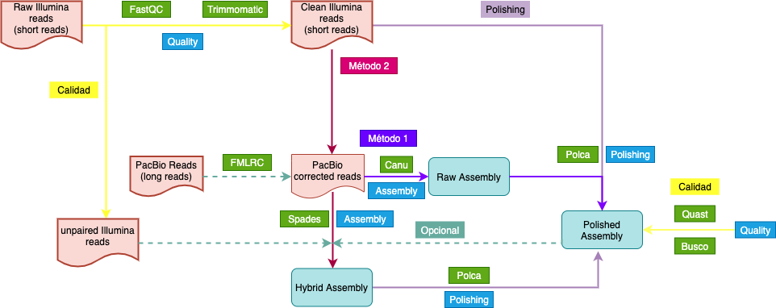

<!-- README.md is generated from README.Rmd. Please edit that file -->
<!-- badges: start -->

<!-- badges: end -->

# Genómica de Levaduras 

**Autor: MsC. Kelly Hidalgo**

Pipeline para montaje y anotación funcional de genomas de levaduras.
Ensamblaje de un genoma de levadura a partir de secuencias largas de
PacBio y cortas de Illumina para corrección de errores.

## Herramientas bioinformáticas

### Instalación Anaconda

Es recomendable instalar Anaconda, pues es la forma más fácil para
instalar las herramientas bioinformáticas necesarias para el desarrollo
de este pipeline. Anaconda es una distribución libre y abierta de los
lenguajes *Python* y *R*, utilizada en ciencia de datos y
bioinformática. Las diferentes versiones de los programas se administran
mediante un sistema de gestión llamado *conda*, el cual hace bastante
sencillo instalar, correr y actualizar programas.
[Aqui](https://conda.io/projects/conda/en/latest/user-guide/install/index.html)
se encuentran las instrucciones para la instalación de Anaconda.

Después de instalado *Anaconda* y su gestor *Conda*, podran ser creados
*ambientes virtuales* para la instalación de las diferentes herramientas
bioinformáticas que serán usadas. Los comandos de instalación serán
presentados a medida que las herramientas van a ser usadas.

------------------------------------------------------------------------

## 0. Organizando los datos

### 0.1. Secuencias

En este tutorial serán usados los datos de secuenciación del genoma de
la levadura *Candida palmioleophila*.

**Archivos**

-   `Cpalmiol_rawdata1.zip`: Secuencias PacBio
-   `Cpalmiol_1.fastq.gz`: Secuencias Illumina (pair 1)
-   `Cpalmiol_2.fastq.gz`: Secuencias Illumina (pair 2)

A continuación hay una serie de comandos para crear y organizar los
directorios de las secuencias brutas

    ## Cree un directorio raiz para todo el processo
    mkdir cpalmiol

    ## Entre al nuevo directorio
    cd cpalmiol/

    ## Cree un nuevo directorio para colocar los datos brutos
    mkdir 00.RawData

    ## Entre en 00.RawData
    cd 00.RawData/

    ## Cree un directorio para cada tipo de secuencias
    mkdir 01.PacBio 02.Illumina

Use el comando `mv` para mover los archivos hasta los directorios
correspondientes.

Al final del proceso de organización debe ver sus directorios así:
`ls 00.RawData/`

    01.PacBio  02.Illumina

`ls 00.RawData/01.PacBio/`

    Cpalmiol_rawdata1.zip

`ls 00.RawData/02.Illumina`

    Cpalmiol_1.fastq.gz  Cpalmiol_2.fastq.gz

Es fuertemente recomendado correr los comandos desde el directorio base,
que para este caso es: `cpalmiol/`

## 1. Control de Calidad

## 1.1. Evaluación de la calidad

Para la evaluación de la calidad será usado el programa
[FastQC](http://www.bioinformatics.babraham.ac.uk/projects/fastqc/) que
es una herramienta que permite observar graficamente la calidad de las
secuencias de Illumina.

### 1.1.1. Instalación

Las instrucciones para instalación usando conda se encuentran
[aqui](https://anaconda.org/bioconda/fastqc). Sin embargo aqui en este
tutorial también serán presentadas

Como ya fue explicado anteriorimente, con conda es posible crear
ambientes virutuales para instalar las herramientas bioinformáticas. El
primer ambiente que será creado se llamará **quality**, donde se
instalaran los programas relacionados con este proceso.

    conda create -n quality

Durante el proceso, el sistema preguntará sí desea proceder con la
creación del ambiente, con las opciones y/n (si o no). Escriba `y` y
después de eso el ambiente virtual estará creado.

Para instalar las herramientas dentro del ambiente anteriormente creado,
es necesario activarlo

    conda activate quality

El ambiente estará activo cuando el nombre de éste se encuentra en el
comienzo de la linea de comando, así: `(quality) user@server:~/$`.

Posteriormente se procede a la instalación del programa:

    conda install -c bioconda fastqc

De nuevo será cuestionado si desea continuar con el proceso o no.
Escriba `y`.

### 1.1.2. Uso

**Illumina**

La primera etapa del proceso es la evaluación de la calidad de las
secuencias cortas (Illumina paired end) usando *FastQC*, con el objetivo
de determinar sí es necesario trimar o filtrar las secuencias de baja
calidad en los próximos pasos.

Ésta etapa es para identificar principalmente las secuencias *outlier*
con baja calidad (*Q* &lt; 20).

Active el ambiente `quality`:

    conda activate quality

    ## Confirme que está en el directorio raíz
    pwd

Debe estar em `~/cpalmiol/`. Si ese no es el resultado del comando
`pwd`, use el comando `cd` para llegar en el directorio base.

Corra **FastQC**:

    ## Cree un directorio para salvar el output de FastQC
    mkdir 01.FastqcReports
    ## Run usando 10 threads
    fastqc -t 10 00.RawData/02.Illumina/* -o 01.FastqcReports/

**Sintaxis** `fastqc [opciones] input -o output`

El comando `fastqc` tiene varias opciones o parametros, entre ellas,
escoger el número de núcleos de la máquina para correr el análisis, para
este caso `-t 10`. El input es el directorio que contiene las secuencias
de illumina `00.RawData/02.Illumina/*`, el `*` indica al sistema que
puede analizar todos los archivos que están dentro de ese directorio. El
output, indicado por el parametro `-o`, es el directorio donde se desea
que sean guardados los resultados del análisis. A continuación se
encuentra una explicación detallada de cada output generado.

**Outputs**

-   Reportes html `Cpalmiol_1_fastqc.html`: Aqui es posible ver toda
    información de calidad graficamente.
-   Zip files `Cpalmiol_1_fastqc.zip`: Aqui se encuentran cada uno de
    los gráficos de manera separada. \*IGNORE\*\*

Descargue los archivos `html` y explore en su *web browser*.

Observe las estadísticas básicas que se encuentran en la primera tabla.
Allí, ud puede saber cuantas secuencias tiene, para este caso son
20′203.852 secuencias paired end, el tamaño de las secuencias es de 151
bp y el %GC es de 39. El gráfico más importante para saber la calidad de
las lecturas es el primero, *Per base sequence quality*. Este gráfico es
un boxblot con la distribución de los valores de calidad *Phred Score*
(eje y) en cada uno de los nucleótidos de las lecturas (eje x). Se
consideran secuencias de excelente calidad cuando el Phred Score&gt;30.
Los datos que están siendo analizados tienen alta calidad, sin embargo,
el pair 2 presenta al final de las lecturas algunos valores outliers que
pueden ser mejorados pasando por una etapa de filtrado con Trimmomatic.
Es normal que el pair 2 presente una calidad un poco inferior al pair 1.

**PacBio**

Para la evaluación de la calidad de las secuencias de PacBio será usado
el kit de herramienta Sequel Tools.

**Instalación SequelTools**

Sequeltools es un programa que provee una colección de tres heramientas
para trabajar con secuencias de PacBio. Las herramientas son: *Quality
Control (QC) tool*, *Read Subsampling tool* y *Read Filtering tool*. La
herramienta *QC* produce múltiples estadísticas y gráficos describiendo
la calidad de los datos, inclueyendo N50, tamaño y cantidad de las
lecturas, entre otras. *Read Subsampling tool* sirve para filtrar las
secuencias usando algún critério, como por ejemplo las *subreads* más
largas.

SequelTools no está dentro de conda, por lo que será instalado de manera
diferente. Sin embargo, primero va a ser creado un ambiente virtual
llamado *quality*, donde se instalarán herramientas relacionadas con la
manipulación de secuencias de PacBio. SequelTools necesita algunas
dependencias para funcionar, com *SamTools*, *Python* y *R*. Para
usuarios de Linux, no es necesario instalar *Python* ni *R* pues vienen
pre instaladas. *SamTools* será instalado dentro del ambiente virtual
*quality*.

    # Crea el ambiente 
    conda create -n quality

    # Activa el ambiente
    conda activate quality

    # Instala SamTools
    conda install -c bioconda samtools

A continuación los comandos para la instalacion *SequelTools* dentro do
ambiente *quality*

    git clone https://github.com/ISUgenomics/SequelTools.git
    cd SequelTools/Scripts
    chmod +x *.sh *.py *.R
    export PATH=$PATH:"$(pwd)"

**Uso**

Los archivos de la secuenciación hecha por PacBio están comprimidos
dentro de un archivo `.zip`, por lo tanto el primer paso es
descomprimirlos.

    # Entra en el directorio de las secuencias PacBio
    cd 00.RawData/01.PacBio
    # Descomprime
    unzip Cpalmiol_rawdata1.zip

El comando `unzip` va a descomprimir el archivo `Cpalmiol_rawdata1.zip`
generando un directorio llamado `Cpalmiol` donde se encuentran varios
archivos, entre ellos, las secuencias en formato `subreads.fasta` y
`subreads.bam`. Para organizar mejor los directorios, pase todos los
archivos de la carpeta `Cpalmiol`, para `~/01.PacBio/` y elimine el
directorio vazio. Siga los siguientes comandos:

    # Desde la carpeta ~/01.PacBio/ mueve los archivos dentro Cpalmiol para ahí
    mv Cpalmiol/* ./
    # Elimina la carpeta Cpalmiol/
    rm -r Cpalmiol/

<table class=" lightable-material-dark" style="font-family: &quot;Source Sans Pro&quot;, helvetica, sans-serif; margin-left: auto; margin-right: auto;">
<thead>
<tr>
<th style="text-align:right;">
Número Reads
</th>
<th style="text-align:right;">
Total Bases
</th>
<th style="text-align:right;">
Tamaño Promedio de las reads
</th>
<th style="text-align:right;">
N50
</th>
</tr>
</thead>
<tbody>
<tr>
<td style="text-align:right;">
631994
</td>
<td style="text-align:right;">
9142012343
</td>
<td style="text-align:right;">
14465
</td>
<td style="text-align:right;">
18964
</td>
</tr>
</tbody>
</table>

### 1.2. Depuración/*Trimming*

Según fue evaluado en el control de calidad, será necesario filtrar
algunas lecturas con una calidad un poco por debajo de lo necesario.
Para esta etapa será usado o programa [Trimmomatic
v0.39](http://www.usadellab.org/cms/?page=trimmomatic) que permite
filtrar (remover) lecturas o *reads* cortas de baja calidad.

Trimmomatic tiene vários parametros que pueden ser considerados para
filtrar lecturas con baja calidad. Aqui usaremos algunos. Si quiere
saber que otros parametros y como funciona cada uno de ellos, consulte
el
[manual](http://www.usadellab.org/cms/uploads/supplementary/Trimmomatic/TrimmomaticManual_V0.32.pdf).

### 1.2.1. Instalación

Como se trata de una herramienta que participa dentro del proceso de
control de calidad, será instalada dentro del ambiente virtual
**quality**

    # Si no está activado el ambiente
    conda activate quality

    # Instale Trimmomatic
    conda install -c bioconda trimmomatic

### 1.2.2. Uso

Para los datos aqui analizados se usará la siguiente linea de comando:

    # Activa el ambiente quality
    conda activate quality

    # Crie un directorio para salvar las lecturas limpias
    mkdir 02.CleanData

    # Crie un directorio para salvar las lecturas no pareadas
    mkdir unpaired

    # Corra Trimmomatic
    trimmomatic PE -threads 10 00.RawData/02.Illumina/Cpalmiol_1.fastq.gz 00.RawData/02.Illumina/Cpalmiol_2.fastq.gz 02.CleanData/Cpalmiol_1_paired.fastq.gz unpaired/Cpalmiol_1_unpaired.fastq.gz 02.CleanData/Cpalmiol_2_paired.fastq.gz unpaired/Cpalmiol_2_unpaired.fastq.gz LEADING:3 TRAILING:3 SLIDINGWINDOW:4:15

**Sintaxis**
`trimmomatic PE -threads input_forward input_reverse output_forward_paired output_forward_unpaired output_reverse_paired output_reverse_unpaired [opciones]`

El comando anterior tiene muchas partes. Primero, el nombre del comando
es `trimmomatic`, a continuación la opción `PE` indica para el programa
que las secuencias que irán a ser analizadas son de tipo *paired end*.
Después se encuentran los inputs, forward (pair1) y reverse (pair2).
Después son los outputs, siendo primero las secuencias forward pareadas
(limpias) y no pareadas (“descartadas”) y después las secuencias
reverse. Por último se encuentran los parametros de filtrado. Para este
caso usamos los parametros `SLIDINGWINDOW`, `LEADING` y `TRAILING`. El
primero de ellos, genera una ventana deslizante, que en este caso va de
4 en 4 bases, cálcula el promedio del *Phred Score* y si está por debajo
de 15 esas bases son cortadas. `LEADING` corta bases del comienzo de la
lectura si están por debajo de *threshold* de calidad, lo mismo hace
`TRAILING` pero al final de las lecturas.

Después de correr Trimmomatic es necesario evaluar la calidad de las
secuencias generadas (“limpias”) usando nuevamente FastQC.

    fastqc -t 10 02.CleanData/* -o 01.FastqcReports/

Descargue los reportes `.html` de las secuencias pareadas
(i.e. `01.FastqcReports/Cpalmiol_1_paired_fastqc.html` y
`01.FastqcReports/Cpalmiol_2_paired_fastqc.html`)

Observe que ahora todas las bases en ambos archivos tienen Phred
Score&gt;30. Después del proceso de filtrado sobrevivieron 20′166.545
*reads*, es decir 99.8 de las secuencias iniciales.

### 1.3. Análisis de Kmers

Este análisis es realizado con el objetivo de determinar el tamaño
aproximado del genoma (**importantísimo para el ensamblaje**) y el grado
de *heterogocidad*. Será usada la herramienta [JellyFish
v2.2.10](https://github.com/gmarcais/Jellyfish/blob/master/doc/Readme.md)
para el cálculo de las métricas y la plataforma online [Genome
Scope](http://qb.cshl.edu/genomescope/) para graficar los resultados.

### 1.3.1. Instalación

Para instalar **JellyFish** será usado Conda y será instalado dentro de
un ambiente virtual llamado **bioinfo**

    # Cree el ambiente
    conda create -n bioinfo

    # Active el ambiente
    conda activate bioinfo

    # Instala Jellyfish
    conda install -c bioconda jellyfish

### 1.3.2. Uso

El análisis será realizado usando como longitud de k-mer 21, que es un
tamaño suficientemente largo como para que la mayoria de los k-mers no
sean repetitivos y es lo suficientemente corta para que el análisis sea
más robusto a los errores de secuenciación. Debido a que a la alta tasa
de error de las secuencias PacBio (\~5-15%), no puede ser usadas para
este análisis. Es necesario usar las secuencias cortas de Illumina que
tienen una tasa de error de alrededor de 2%.

Primero, cree un directorio para los archivos de salida del análisis.

    mkdir 04.KmersAnalysis

Jellyfish solo soporta archivos sin compresión, por eso es necesario
primero descomprimir las secuencias.

    gzip -d 02.CleanData/*

El comando del análisis se encuentra a continuación

    # Si no está activado...
    conda activate bioinfo

    # Jellyfish
    jellyfish count -C -m 21 -s 1000000000 -t 10 02.CleanData/*.fastq -o 04.KmersAnalysis/reads.jf

Usted debe ajustar la memória (`-s`) y los núcleos (`-t`) de acuerdo con
su máquina. El comando anterior usa 10 núcleos/threads y 1Gb de memória
RAM.

A continuación, es necesario exportar el conteo de k-mers para un
histograma, el cual será el input para la plataforma [Genome
Scope](http://qb.cshl.edu/genomescope/) graficar.

    jellyfish histo -t 10 04.KmersAnalysis/reads.jf > 04.KmersAnalysis/reads.histo

Use el archivo `reads.histo` para graficar en *GenomeScope*, modifique
los valores de entrada: Read Length 150.

[Resultados](http://genomescope.org/analysis.php?code=d5CPxD4htefge2NqgdWd)

Observe que el perfil tiene un solo pico, lo que significa que se trata
de un organismo haploide. El porcentaje de heterogocidad es 0.0009%,
confirmando la ploidia. El tamaño del genoma fue estimado en 12.616.309
bp o 12.6 Mbp. El porcentaje de repeticiones es del 1.7% siendo de
222.701 bp.

### 1.4. Cobertura

Cuando se trabaja con secuenciación de genomas, el siguiente paso
después de conocer la cantidad de secuencias obtenidas y remover las
secuencias con baja calidad, es calcular la cobertura o profundidad del
secuenciamiento para ese genoma. El cálculo de la cobertura está dado
por la siguiente ecuación:

*C* = (*L* \* *N*)/*G*
Donde: L es igual al tamaño de las lecturas, N es igual al número de
lecturas, y G es igual al tamaño aproximado del genoma.

Así, entonces para el genoma del presente tutorial, con el
secuenciamiento Illumina tenemos:

*C* = ((150*b**p* \* 2) \* 20166545*b**p*)/12616309*b**p*

    #> [1] "La cobertura con illumina es de 500x"

Con el secuenciamiento PacBio tenemos:

*C* = ((14465 \* 20166545*b**p*)/12616309*b**p*

    #> [1] "La cobertura con PacBio es de 725x"

## 2. Montaje del Genoma de *C. palmioleophila*

El ensamblaje del genoma es la etapa más importante del proceso, porque
el resto de pasos para adelante dependen de que el genoma quede montado
lo “más parecido posible” con la realidad. Por esta razón, serán
testados varios montadores y parametros, para comparar cada ensamblaje y
decidir cual es el mejor para los siguientes procesos.

### 2.1. Conversión de archivos (opcional)

A continuación se encuentra el proceso de conversión del archivo de
secuencias de PacBio `.bam` para `.fastq` usando [BedTools
v2.30.0](https://bedtools.readthedocs.io/en/latest/) , más exactamente
la utilidad `bamtofastq`. (Nota: las secuencias `.fasta` ya están
disponibles en el directorio)

### 2.1.1 Instalación

[BedTools](https://bedtools.readthedocs.io/en/latest/) funciona como una
navaja suiza, es un conjunto de herramientas para una amplia gama de
tareas en análisis genómicos. Por ejemplo, combinación de archivos,
transformar archivos de un formato a otro, etc.

Instale BedTools dentro del ambiente **bioinfo**.

    # Activa el ambiente
    conda activate bioinfo

    # Instala BedTools
    conda install -c bioconda bedtools

### 2.1.2 Uso

Recuerde que *BedTools* fue instalado dentro del ambiente virtual
`bioinfo`

    # Activa el ambiente
    conda activate bioinfo

    # Corra bedtools bamtofastq
    bedtools bamtofastq -i 00.RawData/01.PacBio/m54229_191221_175250.subreads.bam -fq 00.RawData/01.PacBio/Cpalmiol_PB.fq

    # Confirme que el archivo fue creado
    ls 00.RawData/01.PacBio/Cpalmiol_PB.fq

|                                             |
|---------------------------------------------|
| WORKFLOW                                    |
|  |

### 2.2. Correción de errores (opcional)

Opcionalmente las secuencias largas pueden ser corregidas con las
secuencias cortas, usando la herramienta
[FMLRC](https://github.com/holtjma/fmlrc). Sin embargo, para este
pipeline no será abordado esta etapa debido a que la cobertura de las
secuencias de PacBio está muy alta y serán “auto-corregidas” con los
montadores.

### 2.3. Método de Ensamblaje 1

El primer método comprende, el montaje de las secuencias PacBio sin
corregir usando [Canu v2.1.1](https://github.com/marbl/canu).

[Canu v2.2.1](https://github.com/marbl/canu) es un ensamblador, diseñado
especialmente para high-noise single-molecule sequencing, tales como
*PacBio* o *Oxford Nanopore MinION*. Canu opera en tres fases:
corrección, recorte y montaje. La fase de corrección mejorará la
precisión de las bases en las lecturas. La fase de recorte recortará las
lecturas en la parte que parezca ser una secuencia de alta calidad,
eliminando las regiones sospechosas, como el adaptador SMRTbell
restante. La fase de ensamblaje usa el algoritmo
*Overlap-Layaout-Consensus* ordenando las lecturas en contigs, generando
secuencias de consenso y creando gráficos de rutas alternativas.

### 2.3.1. Instalación

Para la instalación de Canu, primero será creado um ambiente virutal
llamado *assembly*, dentro del cual serán instaladas las herramientas
relacionadas con el ensamblaje de genomas.

Siga las siguientes instrucciones para la creación del ambiente virtual
y posterior instalación de **Canu**

    # Cree el ambiente virtual
    conda create -n assembly

    # Active el ambiente virtual
    conda activate assembly

    # Instale Canu
    conda install -c bioconda canu

### 2.3.2. Uso

Para el montaje, serán usadas las secuencias PacBio en formato `.fasta`,
sin embargo, pueden ser usadas también en formato `.fq` (ver 2.1.
Conversión de archivos) **Nota:** Este proceso demora aproximadamente
\~14h.

    # Cria um directorio nuevo para el resultado de Canu
    mkdir 05.Assemblies

    mkdir 05.Assemblies/01.Canu

    # Corre Canu
    canu -p canu -d 05.Assemblies/01.Canu genomeSize=12.6m -maxMemory=25g -maxThreads=15 utgOvlErrorRate=0.065 trimReadsCoverage=2 trimReadsOverlap=500 -pacbio-raw 00.RawData/01.PacBio/Cpalmiol_subreads.fasta

**Sintaxis**
`canu -p prefix -d path/to/output genomeSize=x corThreads=x -pacbio-raw path/to/sequences/file.fa`

El comando es `canu`. El parametro `-p canu` indica al programa que
prefijo usar para todos los archivos de salida.
`-d 05.Assemblies/01.Canu` indica donde ubicar los archivos de salida.
En `genomeSize` se coloca el tamaño esperado (aproximado) del genoma. En
`MaxThreads` se indica el número máximo de núcleos a usar en todas las
etapas del proceso. En `MaxMemory` se indica el número máximo de memória
RAM a usar en todas las etapas del proceso. Y por último `pacbio-raw` es
para indicar el camino a la carpeta que contiene las secuencias.

Durante la corrida, Canu va a imprimir informaciones en la pantalla
relacionadas con cada paso del proceso.

**Output**

En el directorio `05.Assemblies/01.Canu` fueron creados varios outputs,
use el comando `ls` para listar los archivos en el directorio de salida.

-   `canu.contigs.fasta`: contiene las secuencias ensambladas
-   `canu.unassembled.fasta`: son las lecturas que no pudieron ser
    ensambladas.
-   `canu.correctedReads.fasta.gz`: son las secuencias corregidas que
    fueron usadas para el montaje.
-   `canu.contigs.gfa`: es el gráfico del montaje.
-   `canu.report`: es un archivo con el resumen de cada paso que Canu
    realizó com información acerca de las secuencias usadas, y como se
    manejaron y otras informaciones resumidas sobre el montaje.

Siempre es bueno cambiar algunos parametros y correr de nuevo para
comparar los montajes y escoger el mejor. Entonces corra otro montaje
con Canu cambiando los parametros default, según las
[recomendaciones](https://canu.readthedocs.io/en/latest/faq.html#what-parameters-should-i-use-for-my-reads)
de los desarrolladores.

En la primer intento fueron rodados los siguentes parámetros: \*
`rawErrorRate=0.300`: es la diferencia permitida en un *overlap* entre
dos secuencias crudas no corregidas. Para secuencias con calidad baja,
aumente el número. \* `correctedErrorRate=0.045`: es la diferencia
permitida en un *overlap* entre dos secuencias corregidas. Montajes con
baja con baja cobertura, aumnete levemente este número. \*
`minReadLength=1000`: Ignora *reads* menores de ese tamaño. \*
`minOverlapLength=500`: Ignora *overlaps* read-to-read menores de ese
tamaño. \* `corMhapSensitivity="normal"`: baseado en la cobertura del
secuenciamiento (el cual es impactado por el tamaño del genoma), *“low”
sensitivity* si la cobertura es más de 600*x*; *“normal” sensitivity* si
la cobertura está entre 60*x* y 30*x*, y *“high” sinsitivity* si la
cobertura es menor que 30*x*. \* Entre outros parámetros, para más
información consulte
[aqui](https://canu.readthedocs.io/en/latest/parameter-reference.html)

### 2.4. Método 2

En el segundo método, se aborda la obtención de un ensamble híbrido,
usando los dos tipos de secuencias. Opcionalmente pueden ser usadas las
secuencias no pareadas (secuencias “descartadas” por Trimmomatic) y/o el
genoma final del método 1. El montador usado en este método será
[Spades](https://github.com/ablab/spades).

### 2.4.1. Instalación

[Spades v3.15.3](https://github.com/ablab/spades) es uno de los
ensambladores de genomas, más conocido y con mejores resultados, y puede
ser usado tanto para lecturas cortas como largas. Lea atentamente el
[manual](http://cab.spbu.ru/files/release3.15.2/manual.html), ya que
este programa tiene muchas opciones diferentes. Spades usa el algoritmo
del *Grafo de Bruijn* para el montaje de las secuencias.

Siga las siguientes instrucciones para la instalación de **Spades**
dentro do ambiente virtual *assembly*.

    # Active el ambiente virtual
    conda activate assembly

    # Instale Spades
    conda install -c bioconda spades

### 2.4.2 Uso

Para este montaje serán usadas las secuencias limpias Illumina (pair1 y
pair2), las secuencias no pareadas y las secuencias no corregidas de
PacBio. Para este ejemplo no será usado ningún montaje anterior.

Antes de rodar el comando de Spades, es necesario concatenar las
secuencias no pareadas, ya que solo es posible usar un archivo único.
Usando el comando `cat` es posible unir dos archivos y salvar el
resultado en un nuevo archivo

`cat unpaired/Cpalmiol_1_unpaired.fastq.gz unpaired/Cpalmiol_2_unpaired.fastq.gz > unpaired/Cpalmiol_unpaired.fastq.gz`

Corra el programa Spades

    # Cree un directorio para el output
    mkdir 05.Assemblies/02.Spades

    # Spades
    spades.py -t 15 -m 30 -1 02.CleanData/Cpalmiol_1_paired.fastq -2 02.CleanData/Cpalmiol_2_paired.fastq -s unpaired/Cpalmiol_unpaired.fastq.gz --pacbio 00.RawData/01.PacBio/Cpalmiol_subreads.fasta.gz --trusted-contigs 06.Polishing/02.Spades/genome_polished.fa -o 05.Assemblies/02.Spades

**Sintaxis** `spades.py [options] -o output_dir`

-   `--isolate`: Esta flag es recomendado cuando se trata de un aislado
    con alta cobertura de secuenciación. Mejora el montaje y el tiempo
    de corrida.

-   `t`: Número de threads

-   `-m`: Cantidad en gigas de moemoria para el proceso.

-   `-1`: Secuencias cortas, pair 1

-   `-2`: Secuencias cortas, pair 2

-   `-s`: Secuencias no pareadas

-   `--pacbio`: Secuencias PacBio

-   `-o`: Directorio de salida

Para conocer los demás parámetros del comando que no fueran modificados
(usados por *default*), consulte el
[manual](http://cab.spbu.ru/files/release3.15.2/manual.html).

-   `05.Assemblies/02.Spades/corrected/`: contiene las reads corregidas
    por **BayesHammer** en `.fastq.gz`

-   `05.Assemblies/02.Spades/scaffolds.fasta`: contiene los scaffolds
    obtenidos

-   `05.Assemblies/02.Spades/contigs.fasta`: contiene los contigis
    obtenidos

-   `05.Assemblies/02.Spades/assembly_graph_with_scaffolds.gfa`:
    contiene el grafo del montaje en formato GFA 1.0.

-   `05.Assemblies/02.Spades/assembly_graph.fastg`: contiene el grafo
    del montaje en formato FASTG

## 3. Polishing

En esta etapa serán usadas las secuencias cortas de Illumina con el fin
de corregir errores en el genoma montado. Para esto será usado el
programa **Polca** ([MaSuRCA
toolkit](https://github.com/alekseyzimin/masurca)) que en la primera
etapa realiza un alineamiento de las secuencias cortas en el montaje
inicial, usando [BWA](http://bio-bwa.sourceforge.net/bwa.shtml) para
este fin. Posteriormente, usando el alineamiento el programa procederá a
corregir pequeños indels, gaps, montajes errados, etc.

### 3.1. Instalación

[MaSuRCA v4.0.5](https://github.com/alekseyzimin/masurca) (*Maryland
Super Read Cabog Assembler*) es un conjunto de herramientas (*toolkit* )
entre las que están, *MaSuRCA genome assembler*, *QuORUM error
corrector*, *POLCA genome polishing*, *Chromosome scaffolder*,
*Jellyfish kmer counter*, y *MUMmer aligner*. Por ahora usaremos
especialmente **POLCA** para la etapa de *Polishing*. **POLCA** es una
herramienta de pulido destinada a mejorar la precisión del consenso en
conjuntos de genomas producidos a partir de secuencias largas usando
PacBio SMRT o Oxford Nanopore. **POLCA** utiliza lecturas Illumina o
PacBio HIFI para el mismo genoma para mejorar la calidad de consenso del
ensamblaje. Sus entradas son la secuencias del genoma y un archivo (o
archivos) fasta o fastq de las lecturas de Illumina o PacBioHIFI y sus
salidas son el genoma pulido y un archivo VCF con las variantes llamadas
a partir de los datos leídos.

    # Cree un ambiente llamado masurca
    conda create -n masurca

    # Active el nuevo ambiente
    conda activate masurca

    # Instale MaSuRCA
    conda install -c bioconda masurca

[BWA v0.7.17](http://bio-bwa.sourceforge.net/bwa.shtml) es un alineador
de secuencias. Será instalado como dependencia para **POLCA**.

    # instale BWA
    conda install -c bioconda bwa

### 3.2. Uso

El programa **Polca** realiza todo el proceso con una sola linea de
comando.

    ## Activa el ambiente masurca
    conda activate masurca

    ## Cree un directorio para el output
    mkdir 06.Polishing
    mkdir 06.Polishing/01.Canu
    mkdir 06.Polishing/02.Spades

    # Entre al nuevo directorio del método 1
    cd 06.Polishing/01.Canu

Corra Polca

    ## Montaje método 1
    polca.sh -a ../../05.Assemblies/01.Canu/canu.contigs.fasta -r '../../02.CleanData/Cpalmiol_1_paired.fastq ../../02.CleanData/Cpalmiol_2_paired.fastq' -t 15 -m 1G

    # Cambie el nombre del nuevo genoma mejorado
    mv canu.contigs.fasta.polished.fasta genome1_polished.fa

    # Entre al nuevo directorio del método 2
    cd ../02.Spades

    ## Montaje método 2

    polca.sh -a ../../05.Assemblies/02.Spades/scaffolds.fasta -r '../../02.CleanData/Cpalmiol_1_paired.fastq ../../02.CleanData/Cpalmiol_2_paired.fastq' -t 15 -m 1G

    # Cambie el nombre del nuevo genoma mejorado
    mv scaffolds.fasta.PolcaCorrected.fa genome2_polished.fa

Para facilitar, cambie los nombres de los archivos de los nuevos genomas
mejorados

**Sintaxis**

`polca.sh -a genome.fasta -r 'reads1.fastq reads2.fastq' -t [núm threads] -m [gigas de memoria]`

-   `-a`: Genoma montado
-   `-r`: reads cortas
-   `-t`: Número de núcleos/threads
-   `-m`: Gigas de memoria por thread para samtools

**Outputs**

Polca va a generar una serie de archivos relacionados al mapeo de las
secuencias cortas en el montaje. Los dos *outputs* más importantes son
`*.contigs.fasta.report` y `*.contigs.fasta.PolcaCorrected.fa`. En el
primero se encuentran las estadísticas básicas del proceso y el segundo
es el genoma mejorado.

`less canu.contigs.fasta.report`

    Substitution Errors: 31
    Insertion/Deletion Errors: 56
    Assembly Size: 13394208
    Consensus Quality: 99.9994

`less scaffold.fasta.report`

    Substitution Errors: 57
    Insertion/Deletion Errors: 4
    Assembly Size: 17046023
    Consensus Quality: 99.9996

Se puede observar que para el método de ensamblaje 1, fueron corregidos
31 errores de substitución, 56 de inserción o deleción y que la calidad
consenso del genoma es 99.99%. En cuanto que para el método 2…

## 4. Calidad de los montajes

Para evaluar la calidad de los montajes, serán usadas dos herramientas,
**Quast** y **Busco**.

### 4.1. Quast

[Quast v5.0.2](http://quast.sourceforge.net/docs/manual.html) (*QUality
ASsesment Tool*) es posible evaluar las principales estadísticas del
montaje (i.e. N50, número de contigs, tamaño total del montaje, tamaño
de los contigs, etc). **Quast** genera una serie de archivos y reportes
donde es posible observar esas estadísticas básicas del montaje. Serán
comparados los montajes antes y después de la etapa de *polishing* de
los métodos de ensamblaje, con el objetivo de escoger el mejor, para las
siguientes etapas.

### 4.1.1. Instalación

    # Active el ambiente bioinfo
    conda activate bioinfo

    # Instale Quast
    conda install -c bioconda quast

### 4.1.2. Uso

    ## Vuelva al diretorio base

    cd ../../

    # Active el ambiente bioinfo
    conda activate bioinfo

    # Crie um diretório para el output
    mkdir 07.AssemblyQuality
    mkdir 07.AssemblyQuality/01.Quast

    # Corra Quast
    quast.py 05.Assemblies/01.Canu/canu.contigs.fasta 05.Assemblies/02.Spades/scaffolds.fasta 06.Polishing/01.Canu/genome_polished.fa 06.Polishing/02.Spades/genome2_polished.fa -o 07.AssemblyQuality/01.Quast

**Sintaxis**
`quast.py path/to/assembly/contigs.fasta -o path/to/output/`

**Interpetación de los resultados**

La idea de usar **Quast**, aparte de evaluar las estidísticas básicas
del montaje, es comparar varios montajes para escoger el mejor. Por
ejemplo: entre menor sea el número de contigs es mejor, porque significa
que el genoma quedó menos fragementado. Y eso se reflejará en el tamaño
de los contigs que serán grandes. El valor de N50, es mejor entre mayor
sea. Así mismo, es ideal menor número de gaps y Ns.

**Outputs**

Explore el directorio de output usando el comando `ls`.

-   `07.AssemblyQuality/01.Quast/report.html`: Este reporte puede ser
    abierto en un *web browser* y contiene las informaciones más
    relevantes. Como número de contigs, tamaño del mayor contig, tamaño
    total del montaje, N50, etc.

-   `07.AssemblyQuality/01.Quast/report.tex`,
    `07.AssemblyQuality/01.Quast/report.txt`,
    `07.AssemblyQuality/01.Quast/report.tsv`,
    `07.AssemblyQuality/01.Quast/report.pdf`: es el mismo reporte pero
    en diferentes formatos.

-   `07.AssemblyQuality/01.Quast/transposed_report.tsv`,
    `07.AssemblyQuality/01.Quast/transposed_report.tex`,
    `07.AssemblyQuality/01.Quast/transposed_report.tex`: También es el
    reporte pero con otro formato de las tablas.

-   `07.AssemblyQuality/01.Quast/icarus_viewers/contig_size_viewer.html`:
    Aqui puede ver graficamente los contigs.

-   `07.AssemblyQuality/01.Quast/basis_stats/`: Dentro de esta carpeta
    se encuentran varios gráficos en formato `.pdf`.

## 4.2. Busco

[BUSCO](https://busco.ezlab.org/busco_userguide.html) está baseado en
las expectativas evolutivas del contenido de genes ortólogos de copia
única. Es decir, con esta herramienta podemos evaluar que tan completo
está el genoma, teniendo en cuenta los genes de copia única y así mismo
que tan contaminado está si estos genes son encontrados más de una vez
en el genoma. Para esto es usado un conjunto de genes encontrados en
linajes relacionadas al genoma en estudio. Para nuestro caso, será usado
el conjunto de genes de la clase Saccharomycetes.

### 4.2.1. Instalación

Por problemas de compatibilidad de la versión de *Python* usada por este
programa, es mejor instalarlo en un ambiente virtual separado.

    # Crea el ambiente virtual e instala Busco
    conda create -n busco -c conda-forge -c bioconda busco=5.2.2

### 4.2.2. Uso

    # Entre a la carpeta 07.AssemblyQuality
    cd 07.AssemblyQuality/

    ## Cree directorios para cada genoma a evaluar
    mkdir 02.Busco

    cd 02.Busco/

    # Activa el ambiente busco
    conda activate busco

Antes de correr el análisis en BUSCO, explore las opciones en el menú de
ayuda, con `busco -h`.

    # Busco para CanuNoPolished
    busco -m genome -i ../../05.Assemblies/01.Canu/canu.contigs.fasta -o CanuNoPolished -l saccharomycetes_odb10 -c 15

    # Busco para SpadesNoPolished
    busco -m genome -i ../../05.Assemblies/01.Canu/canu.contigs.fasta -o SpadesNoPolished -l saccharomycetes_odb10 -c 15

    # Busco para CanuPolished
    busco -m genome -i ../../05.Assemblies/01.Canu/canu.contigs.fasta -o CanuPolished -l saccharomycetes_odb10 -c 15

    # Busco para SpadesPolished
    busco -m genome -i ../../05.Assemblies/01.Canu/canu.contigs.fasta -o SpadesPolished -l saccharomycetes_odb10 -c 15

**Sintaxis**

`busco -m [mode] -i [sequence_file] -l [lineage] [other options]`

-   `-m` o `--mode`: hay tres modos dependiendo del tipo de información
    que se va a analizar: genome, proteins, transcriptome.

-   `-i` o `--in`: datos de entrada, p.e. contigs montados.

-   `-l` o `--lineage_dataset`: informe aqui la base de datos que quiere
    usar, según el linaje escogido. Para saber que linajes se encuentran
    en la base de datos de BUSCO, digite `busco --list-datasets`.

**Interpretación de los resultados**

**Busco** intenta proporcionar una evaluación cuantitativa de la
completitud en términos del contenido génico esperado de un genoma
montado. Los resultados se simplifican en las categorías *complete* y
*single-copy*, *complete* y *duplicated*, *fragmented* o *missing*
BUSCOs.

Los resultados de la completud de BUSCO tienen sentido solo en el
contexto de la biología de su organismo. Debe comprender si los genes
faltantes (*missing*) o duplicados (*duplicated*) son de origen
biológico o técnico. Por ejemplo, un alto nível de duplicación puede
explicarse por un evento de duplicación completo reciente (biológico) o
un ensamblaje quimérico de haplotipos (técnico).

**outputs**

-   `*/run_saccharomycetes_odb10/busco_sequences`: dentro de esta
    carpeta se encuentran las secuencias en formato `.fasta` de los
    BUSCOs **fragmented** (`fragmented_busco_sequences/`), *multi-copy*,
    (`multi_copy_busco_sequences/`), *single-copy*
    (`single_copy_busco_sequences/`).

-   `*/run_saccharomycetes_odb10/short_summary.txt`: Es un archivo de
    texto plano que contine el resumen de los resultados de BUSCO. Aqui
    se encuentra el resultado final, es decir, el número y porcentaje de
    BUSCOs completos, single-copy, duplicados, fragmentados y missing.

-   `*/un_saccharomycetes_odb10/full_table.tsv`: Es una tabla con los
    resultados completos, con *scores* y tamaños de los BUSCOs
    encontrados, además de las coordinadas dentro del genoma.

-   `*/run_saccharomycetes_odb10/missing_busco_list.tsv`: Contiene la
    lista de *missing BUSCOs*.

-   `*/run_saccharomycetes_odb10/hmmer_output/`: tablas con la salida de
    HMMER con las busquedas de BUSCOs HMMs.

-   `*/run_saccharomycetes_odb10/meaeuk_output/`: Resultados de la
    predicción de genes con *Metaeuk*.

-   `*/busco_downloads/`: en este directorio está la base de datos que
    BUSCO descargó, según el linaja escogido, Saccharomycetes.

-   `*/logs/`: Aqui se encuentran los logs de cada programa usado
    durante el processo, `busco.log`, `hmmsearch_err.log`,
    `hmmsearch_out.log`, `metaeuk_err.log` y `metaeuk_out.log`.

**Gráfico**

Los desarrolladores de **Busco** disponibilizaron un script de
**Python** y **R** para graficar los resultados. Para generar un gráfico
con todos los resultados de los cuatro genomas evaluados siga los
siguientes comandos, que tienen por objetivo recopliar los
`short_summary.txt` de cada genoma:

    # Cree un directorio 
    mkdir BUSCO_summaries

    # copie los short_summary de cada genoma
    cp CanuNoPolished/short_summary.specific.saccharomycetes_odb10.CanuNoPolished.txt BUSCO_summaries/.
    cp SpadesNoPolished/short_summary.*.lineage_odb10.SpadesNoPolished.txt BUSCO_summaries/.
    cp CanuPolished/short_summary.*.lineage_odb10.CanuPolished.txt BUSCO_summaries/.
    cp SpadesPolished/short_summary.*.lineage_odb10.SpadesPolished.txt BUSCO_summaries/.

Para generar el gráfico:

    python3 generate_plot.py -wd BUSCO_summaries/

Rapidamente será generado un gráfico de barras con el porcentaje de cada
tipo de genes encontrados en el genoma.

> ## Genoma final!
>
> Según los resultados obtenidos de la evaluación de la calidad de los
> montajes, fue seleccionado el genoma montado por el programa Canu, y
> púlido por el programa Polca. Este genoma tiene 8 contigs, tiene una
> completeza de 99.6% y 0.4% de contaminación. El genoma se encuentra en
> el directorio `06.Polishing/01.Canu/genome_polished.fa`. Este genoma
> será usado para las siguientes etapas.

## 5. Predicción de genes

La primera etapa después de obtener el mejor genoma montado es predecir
los genes presentes. Para esto será usado el programa
[**Augustus**](http://bioinf.uni-greifswald.de/augustus/). Ésta
ferramenta tiene la información de los genes de [varias
especies](http://bioinf.uni-greifswald.de/augustus/datasets/) de
organismos que ayuda al algorítmo a encontrar las señales de ínicio y
fin de cada gen. Sin embargo para el caso específico de *C.
palmioleophila* no existe esta información. En este punto hay dos
opciones, la primera, predecir los genes usando especies próximas
disponibles en la base de datos de **Augustus** (*C. tropicalis, C.
guillermondi, C. albicans*), la segunda opción es entrenar el programa
para reconocer donde inician y finalizan los genes de la especie en
estudio. Este proceso es complejo y envuelve varias etapas. Por esta
razón en este tutorial será abordada solamente la primera opción.

### 5.1. Instalación

[**Augustus**](https://github.com/Gaius-Augustus/Augustus) puede ser
usado desde un [*web
server*](http://bioinf.uni-greifswald.de/augustus/submission.php), o ser
instalado usando Anaconda.

Para la instalación de esta herramienta, será creado un ambiente
virtual, llamado **augustus**.

    # Cree el ambiente virtual
    conda create -n augustus

    # Instale Augustus

    conda install -c bioconda augustus

### 5.2. Uso

Revise el
[manual](https://github.com/Gaius-Augustus/Augustus/blob/master/docs/RUNNING-AUGUSTUS.md)
de Augustus, pues éste programa tiene muchas opciones diferentes para
rodar la predicción de los genes. A continuación será rodado el comando
básico para esta etapa.

    # Cree un directorio para el output
    mkdir 08.GenePrediction

**Augustus**

    ## Usando la informacion de C. Tropicalis
    augustus --species=candida_tropicalis --gff3=on --cds=on 06.Polishing/01.Canu/genome_polished.fa > 08.GenePrediction/C.tropicalis.GenePrediction.gff 

**Sintaxis**

`augustus [parameters] --species=SPECIES queryfilename > output.gff`

-   parameters: Para conocer todos los parámetros customizables de
    augustus vea en el manual, en la sección [important
    parameters](https://github.com/Gaius-Augustus/Augustus/blob/master/docs/RUNNING-AUGUSTUS.md)

-   `--species`: Aqui indique la especie de la base de datos que será
    usada para ayudar al algorítmo a reconocer el incio y fin de los
    genes.

-   `queryfilename`: Aqui coloque el camino para el archivo de las
    secuencias sobre las cuales será hecha la predicción de los genes,
    en este caso el genoma.

-   `output.gff`: nombre del archivo de salida con extensión `.gff`.

**Formato `.gff` (Gene Feature Format)**

Este formato guarda las informaciones de los genes predichos por
Augustus. Explorelo (`less C.tropicalis.GenePrediction.gff`).

Es una tabla separada por tabulaciones con las siguientes informaciones:

1.  **seqname**: nombre de la secuencia, en este caso nombre del contig.
2.  **source**: nombre del programa que generó la predicción.
3.  **feature**: tipo de *feature*, p.e. gene, mRNA, variant, exon.
4.  **start**: primera posición de la *feature*
5.  **end**: útlima posición de la *feature*
6.  **score**: un punto
7.  **strand**: En que cadena del DNA fue encontrado la *feature*. La
    cadena *forward* es definida como ‘+’, y la reverse como ‘-’.
8.  **frame**: 0 indica que la primera base de la *feature* es la
    primera base del codón de inicio, 1, significa que la segunda base
    de la *feature* es la primera base del codón ide inicio.
9.  **atribute**: información adicional sobre la *feature*.

-   Por último, es posible encontrar la secuencia proteíca del gen.

**Ejercício:** Genere la predicción de genes usando las otras dos
especies de *Candida* presentes en la base de datos de Augustus, y
explore todos los archivos `.gff` generados.

## 6. Anotación Funcional

Después de conocer donde inician y finalizan los genes, ahora es posible
“anotarlos” funcionalmente. Anotar, se refiere al proceso de alinear las
secuencias de los genes contra diferentes bases de datos, con el
objetivo de conocer cual es su función, es decir que hace cada gen. En
esta etapa serán usadas varias bases de datos, como *UniProt*, *EggNOG*,
*KEGG*.

### 6.1. Extracción de Secuencias

Antes de iniciar el proceso de anotación de los genes, es necesario
extraer las secuencias proteícas de los archivos `.gff`. Para esta tarea
será usado el programa
[**GFFREAD**](https://github.com/gpertea/gffread). Es un programa
especializado en la manipulación y gestión de archivos con extensión
`.gff` y `.gtf`.

**GFFREAD** será instalado en el ambiente virtual **bioinfo**.

    # Active el ambiente bioinfo
    conda activate bioinfo

    # Instale GFFREAD
    conda install -c bioconda gffread

### 6.1.1. Uso

Como fue mencionado antes, primero es necesario extraer las secuencias
proteícas de los genes producto de la predicción de los genes y
guardarlos en archivos formato `.fasta`

A continuación se encuentra el comando de **GFFREAD** para extaer las
secuencias desde los archivos `.gff`.

    # Si no está activado
    conda activate bioinfo

    # GFFREAD
    gffread 08.GenePrediction/C.tropicalis.GenePrediction.gff -g 06.Polishing/01.Canu/genome_polished.fa -w 08.GenePrediction/c.tropicalis_prediction.fasta

**Sintaxis**

`gffread file.gff -g genome.fa -w sequences.fasta`

-   `file.gff`: Aqui coloque el archivo `.gff` del cual desea extraer
    las secuencias.

-   `-g`: aqui coloque el genoma desde el cual fue hecha la predicción
    de los genes. Los nombres de las secuencias (contigs) deben
    concordar con la primera columna del archivo `.gff`.

-   `-w`: archivo de salida `.fasta`.

**Ejercício 1**

Extraiga las secuencias de las predicciones de genes hechas con las
otras especies relacionadas de *Candida*.

Después de este proceso, ud debe tener tres archivos `.fasta` con las
secuencias de los genes detectados por **Augustus** usando como base las
especies de *Candida* disponibles en la base de datos. Ahora puede
alinearlos con las bases de datos de interés.

**Ejercício 2**

Usando el comando `grep` cuente el número de secuencias/genes en cada
archivo.

### 6.2. Bases de Datos

### 6.2.1. Obtención de las bases de datos

**EggNOG** En primer lugar será realizado la anotación usando **Blast**
contra la base de datos de **EggNOG**. Para descargar use el comando
`wget`

    # Cree un directorio para colocar las bases de datos
    mkdir DataBases

    # Entre al directorio
    cd Databases/

    # Descargue 
    wget http://eggnog5.embl.de/download/eggnog_4.5/eggnog4.proteins.all.fa.gz

    # Descomprima
    gzip -d eggnog4.proteins.all.fa.gz

**UniProtSwiss-Prot**

[Swiss Prot](https://www.expasy.org/resources/uniprotkb-swiss-prot) es
una base de datos con proteinas que su función ya fue establecida con
experimentación.

    # Entre al directorio DataBases
    cd DataBases/

    # Descargue SwissProt
    wget https://ftp.uniprot.org/pub/databases/uniprot/current_release/knowledgebase/complete/uniprot_sprot.fasta.gz

    # Descomprima
    gzip -d uniprot_sprot.fasta

**Bases de datos personalizadas**

Una opción también es crear pequeñas bases de datos con secuencias de
interes obtenidas del NCBI. Para esto solo es necesario organizar todas
las secuencias dentro de un archivo `.fasta`.

Para este tutorial tenemos dos bases de datos personalizadas, la primera
es referente a secuencias de lipasas (`DataBases/lips_seqs.fa`) y la
segunda a genes de virulencia (`DataBases/virulence_seqs.fa`).

### 6.2.2. Instalación Alineador Blast

Existen varios programas de alineamiento, los más conocidos son
[**Blast+**](https://github.com/enormandeau/ncbi_blast_tutorial) y
[**Diamond**](https://github.com/bbuchfink/diamond). Para este tutorial
será usado **Blast+**, el cual será instalado usando conda dentro del
ambiente virtual **mapping**.

    # Active el ambiente
    conda activate mapping

    # Instale Blast
    conda install -c bioconda blast

### 6.2.3. Formatación de las bases de datos

Una vez escogido el alineador a ser usado, es necesario formatar las
bases de datos para el software específico. Para formatar las bases en
**Blast**, es usado el comando `makeblastdb`

**EggNOG**

    # Active el ambiente mapping
    conda activate mapping

    # formate la base de datos EggNOG
    makeblastdb -in DataBases/eggnog4.proteins.all.fa  -title eggnog4 -dbtype prot -out DataBases/eggno4

**Sintaxis**
`makeblastdb -in reference.fasta -d ReferenceName -p threads`

-   `makeblastdb`: nombre del comando para formatar las bases de datos

-   `-in`: base de datos en formato `.fasta` a ser formatada

-   `-title`: nombre para la base de datos

-   `-dbtype`: tipo de secuencias, prot, nucl

-   `out`: Camino para los archivos de salida

**Swiss-Prot**

     makeblastdb -in DataBases/uniprot_sprot.fasta -title swissprot -dbtype prot -out DataBases/swissprot

**Secuencias de Lipasas**

    makeblastdb -in DataBases/lips_seqs.fa -title lips -dbtype nucl -out DataBases/lips

**Secuencias Genes de virulencia**

    makeblastdb -in DataBases/virulence_seqs.fa -title virulence -dbtype nucl -out DataBases/virulence

### 6.2.3. Anotación

Después de descargar y formatar las bases de datos es posible generar la
anotación de los genes obtenidos en la predicción usando **Blast**.

A continuación encuentrará la línea de comando, para la anotación con
cada una de las bases de datos:

**EGGNOGG**

    # cree directorios para cada levadura usada como base
    mkdir 09.GeneAnnotation/tropicalis
    mkdir 09.GeneAnnotation/guilliermondii
    mkdir 09.GeneAnnotation/albicans

    # Blast
    blastp -db DataBases/eggno4 -query 08.GenePrediction/c.tropicalis_prediction.fasta -num_threads 15 -evalue 1e-10 -word_size 11 -outfmt 6 > 09.GeneAnnotation/tropicalis/eggnog.txt

**Swiss-Prot**

    blastp -db DataBases/swissprot -query 08.GenePrediction/c.tropicalis_prediction.fasta -evalue 1e-10 -num_threads 15 -word_size 6 -outfmt 6 > 09.GeneAnnotation/tropicalis/swissprot.txt

**Lipasas**

    blastn -db DataBases/lips -query 08.GenePrediction/c.tropicalis_prediction.fasta -evalue 1e-10 -num_threads 15 -word_size 11 -outfmt 6 > 09.GeneAnnotation/tropicalis/lips.txt

**Genes de virulencia**

    blastn -db DataBases/virulence -query 08.GenePrediction/c.tropicalis_prediction.fasta -evalue 1e-10 -num_threads 15 -word_size 11 -outfmt 6 > 09.GeneAnnotation/tropicalis/virulence.txt

**Colocando los *headers* de las tablas**

Crie um arquivo de texto dentro da pasta `09.GeneAnnotation/` chamado
`headers.txt`, use o editor de texto nano. Dentro del archivo copie los
siguientes titulos de las columnas de las tablas generadas en la
anotación por blast

    qseqid sseqid pident length mismatch gapopen qstart qend sstart send evalue bitscore

**Ejercicio 3**

Usando `cat`, concatene el archivo `headers.txt` a cada uno de los
archivos de texto de la anotación
`eggnog.txt swissprot.txt lips.txt virulence.txt` y cree nuevos archivos
con los títulos de las columnas (p.e.`eggnog_headers.txt`)

**Ejercicio 4**

Genere la anotación de las bases de datos personalizadas (lipasas y
genes de virulencia) usando las otras predicciones realizadas con base a
las otras especies de levaduras.

**Output**

-   **Columna 1 qseqid** Sequence id *query*
-   **Columna 2 sseqid** Sequence id *subject*
-   **Columna 3 pident** Porcentaje de identidad
-   **Columna 4 length** Tamaño del alineamiento
-   **Columna 5 mismatch** número of mismatches
-   **Columna 6 gapopen** número de gaps
-   **Columna 7 qstart** inicio del alineamiento en el *query*
-   **Columna 8 qend** fin del alineamiento en el *query*
-   **Columna 9 sstart** inicio del alineamiento en el *subject*
-   **Columna 10 send** fin del alineamiento en el *subject*
-   **Columna 11 evalue** value esperado
-   **Columna 12 bitscore** *bit score*

El *evalue* y el *bitscore* pueden ser entendidos en este
[link](https://www.metagenomics.wiki/tools/blast/evalue).

> ## Próximas etapas recomendadas
>
> -   Modificar parámetros en la predicción de genes
> -   Modificar parámetros en la anotación de genes
> -   Usar otras bases de datos (p.e. KEGG, InterPro, TIGRFAM, Pfam,
>     UniProt)

------------------------------------------------------------------------

# Transcriptómica

En construcción
